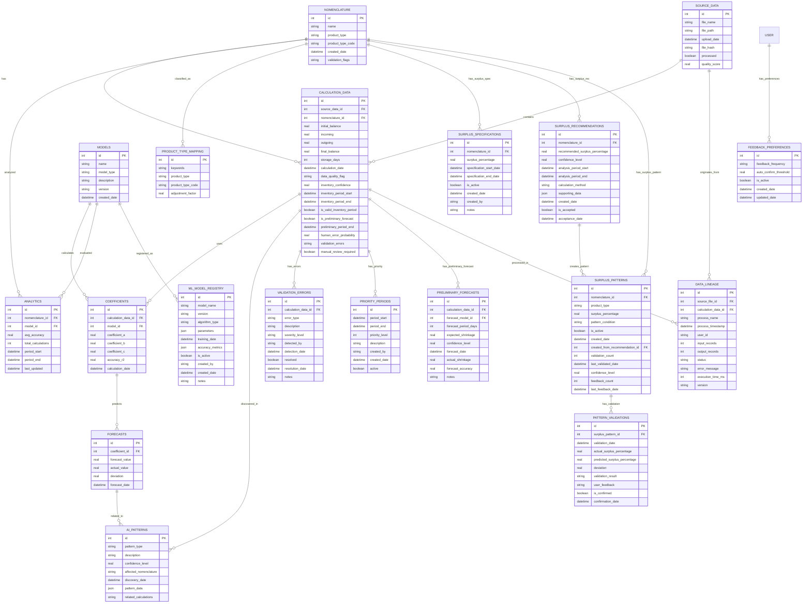

# Дизайн базы данных для анализа системы расчета коэффициентов усушки с глобальной очисткой данных и приоритизацией периодов

## 1. Обзор

В рамках проекта "Система Расчета Коэффициентов Нелинейной Усушки" предлагается создать базу данных для хранения и анализа данных, связанных с расчетами коэффициентов усушки рыбной продукции. Особое внимание уделяется глобальной очистке данных и возможности задавать периоды с повышенным приоритетом для анализа. Данная база данных будет интегрирована с существующими компонентами системы и использоваться для:

- Хранения исторических данных о расчетах усушки из реальных отчетов
- Анализа точности прогнозов базовой и адаптивной моделей
- Отслеживания адаптации моделей на основе реальных данных
- Сравнения эффективности различных типов моделей (экспоненциальная, линейная, полиномиальная)
- Хранения метаданных о продукции, типах продукции и условиях хранения
- Поддержки машинного обучения через накопление данных об эффективности прогнозов
- Глобальной очистки и фильтрации "грязных" данных по всему набору
- Извлечения корректных инвентаризационных записей
- Обнаружения скрытых паттернов в данных с использованием ИИ
- Задания периодов с повышенным приоритетом для детального анализа
- Подготовки опциональной интеграции с 1С:Предприятие 8.3 (Штрих-М: Торговое предприятие 7)

## 2. Архитектура

### 2.1 Общая структура

База данных будет состоять из нескольких основных компонентов:

1. **Хранилище исходных данных** - хранение оригинальных Excel файлов из директории `исходные_данные`
2. **Хранилище промежуточных данных** - нормализованные данные для расчетов на основе `NomenclatureRow`
3. **Хранилище результатов** - результаты расчетов коэффициентов усушки для базовой и адаптивной моделей
4. **Хранилище моделей** - информация о параметрах моделей (`ShrinkageCalculator`, `AdaptiveShrinkageModel`) и их адаптации
5. **Хранилище аналитики** - агрегированные данные для анализа эффективности и сравнения моделей
6. **Хранилище типов продукции** - справочник типов продукции и правил их классификации

### 2.2 Технологический стек

Для реализации базы данных предлагается использовать:
- **PostgreSQL** - мощная, расширяемая СУБД с открытым исходным кодом, специально подходящая для хранения и анализа временных рядов данных усушки. Обладает полной поддержкой ACID, объектно-ориентированным функционалом и эффективной обработкой сложных структур данных
- **TimescaleDB** (расширение для PostgreSQL) - для эффективной работы с данными временных рядов, автоматического разделения данных по времени и сжатия. Идеально подходит для хранения данных инвентаризаций и расчета коэффициентов усушки
- **SQLAlchemy** - ORM для Python для работы с базой данных, обеспечивающий простую интеграцию с существующим кодом проекта
- **Pandas** - для обработки и анализа данных, уже используемый в проекте
- **Scikit-learn** - для реализации алгоритмов машинного обучения при поиске паттернов в данных усушки
- **NumPy** - для численных вычислений в алгоритмах ИИ
- **PL/Python** (процедурный язык PostgreSQL) - для выполнения Python-скриптов прямо в базе данных при сложных расчетах коэффициентов

## 3. Модели данных

### 3.1 Основные сущности

#### 3.1.1 Исходные данные (source_data)
Хранит информацию об исходных файлах данных

| Поле | Тип | Описание |
|------|-----|----------|
| id | INTEGER (PK) | Уникальный идентификатор |
| file_name | TEXT | Имя файла |
| file_path | TEXT | Путь к файлу |
| upload_date | DATETIME | Дата загрузки |
| file_hash | TEXT | Хэш файла для проверки целостности |
| processed | BOOLEAN | Флаг обработки файла |
| quality_score | REAL | Оценка качества данных (0-1) |

#### 3.1.2 Номенклатура (nomenclature)
Хранит информацию о номенклатурных позициях

| Поле | Тип | Описание |
|------|-----|----------|
| id | INTEGER (PK) | Уникальный идентификатор |
| name | TEXT | Название номенклатуры |
| product_type | TEXT | Тип продукции |
| product_type_code | TEXT | Код типа продукции |
| created_date | DATETIME | Дата создания записи |
| validation_flags | TEXT | Флаги валидации данных |

#### 3.1.3 Расчетные данные (calculation_data)
Хранит нормализованные данные для расчетов

| Поле | Тип | Описание |
|------|-----|----------|
| id | INTEGER (PK) | Уникальный идентификатор |
| source_data_id | INTEGER (FK) | Ссылка на исходные данные |
| nomenclature_id | INTEGER (FK) | Ссылка на номенклатуру |
| initial_balance | REAL | Начальный остаток |
| incoming | REAL | Приход |
| outgoing | REAL | Расход |
| final_balance | REAL | Конечный остаток |
| storage_days | INTEGER | Период хранения (дней) |
| calculation_date | DATETIME | Дата расчета |
| data_quality_flag | TEXT | Флаг качества данных (clean, dirty, filtered) |
| inventory_confidence | REAL | Уровень доверия к инвентаризационным данным (0-1) |
| inventory_period_start | DATETIME | Дата начала периода инвентаризации |
| inventory_period_end | DATETIME | Дата окончания периода инвентаризации |
| is_valid_inventory_period | BOOLEAN | Флаг корректного периода между инвентаризациями |
| is_preliminary_forecast | BOOLEAN | Флаг предварительного прогноза (инвентаризация только начало периода) |
| preliminary_period_end | DATETIME | Предполагаемая дата окончания периода для предварительного прогноза |
| human_error_probability | REAL | Вероятность наличия ошибок, вызванных человеческим фактором (0-1) |
| validation_errors | TEXT | Описание выявленных ошибок валидации |
| manual_review_required | BOOLEAN | Флаг необходимости ручной проверки |

#### 3.1.4 Модели (models)
Хранит информацию о моделях расчета

| Поле | Тип | Описание |
|------|-----|----------|
| id | INTEGER (PK) | Уникальный идентификатор |
| name | TEXT | Название модели |
| model_type | TEXT | Тип модели (exponential, linear, polynomial) |
| description | TEXT | Описание модели |
| version | TEXT | Версия модели |
| created_date | DATETIME | Дата создания |

#### 3.1.5 Коэффициенты (coefficients)
Хранит рассчитанные коэффициенты

| Поле | Тип | Описание |
|------|-----|----------|
| id | INTEGER (PK) | Уникальный идентификатор |
| calculation_data_id | INTEGER (FK) | Ссылка на расчетные данные |
| model_id | INTEGER (FK) | Ссылка на модель |
| coefficient_a | REAL | Коэффициент a |
| coefficient_b | REAL | Коэффициент b |
| coefficient_c | REAL | Коэффициент c |
| accuracy_r2 | REAL | Точность (R²) |
| calculation_date | DATETIME | Дата расчета |

#### 3.1.6 Прогнозы (forecasts)
Хранит прогнозы усушки

| Поле | Тип | Описание |
|------|-----|----------|
| id | INTEGER (PK) | Уникальный идентификатор |
| coefficient_id | INTEGER (FK) | Ссылка на коэффициенты |
| forecast_value | REAL | Прогнозируемое значение усушки |
| actual_value | REAL | Фактическое значение усушки |
| deviation | REAL | Отклонение прогноза |
| forecast_date | DATETIME | Дата прогноза |

#### 3.1.7 Аналитика (analytics)
Хранит агрегированные данные для анализа

| Поле | Тип | Описание |
|------|-----|----------|
| id | INTEGER (PK) | Уникальный идентификатор |
| nomenclature_id | INTEGER (FK) | Ссылка на номенклатуру |
| model_id | INTEGER (FK) | Ссылка на модель |
| avg_accuracy | REAL | Средняя точность |
| total_calculations | INTEGER | Общее количество расчетов |
| period_start | DATETIME | Начало периода анализа |
| period_end | DATETIME | Конец периода анализа |
| last_updated | DATETIME | Дата последнего обновления |

#### 3.1.8 Паттерны ИИ (ai_patterns)
Хранит паттерны и аномалии, найденные с помощью ИИ

| Поле | Тип | Описание |
|------|-----|----------|
| id | INTEGER (PK) | Уникальный идентификатор |
| pattern_type | TEXT | Тип паттерна (anomaly, trend, seasonality, correlation) |
| description | TEXT | Описание паттерна |
| confidence_level | REAL | Уровень доверия ИИ (0-1) |
| affected_nomenclature | TEXT | Список затронутых номенклатур |
| discovery_date | DATETIME | Дата обнаружения |
| pattern_data | JSON | Структурированные данные паттерна |
| related_calculations | TEXT | Ссылки на связанные расчеты |

#### 3.1.9 Ошибки валидации (validation_errors)
Хранит информацию об ошибках, найденных в данных

| Поле | Тип | Описание |
|------|-----|----------|
| id | INTEGER (PK) | Уникальный идентификатор |
| calculation_data_id | INTEGER (FK) | Ссылка на расчетные данные |
| error_type | TEXT | Тип ошибки (human_factor, validation_failure, data_inconsistency) |
| description | TEXT | Описание ошибки |
| severity_level | TEXT | Уровень серьезности (low, medium, high, critical) |
| detected_by | TEXT | Метод обнаружения (AI, manual_review, validation_rule) |
| detection_date | DATETIME | Дата обнаружения ошибки |
| resolved | BOOLEAN | Флаг устранения ошибки |
| resolution_date | DATETIME | Дата устранения ошибки |
| notes | TEXT | Дополнительные заметки |

#### 3.1.10 Приоритетные периоды (priority_periods)
Хранит информацию о периодах с повышенным приоритетом для анализа

| Поле | Тип | Описание |
|------|-----|----------|
| id | INTEGER (PK) | Уникальный идентификатор |
| period_start | DATETIME | Начало приоритетного периода |
| period_end | DATETIME | Окончание приоритетного периода |
| priority_level | INTEGER | Уровень приоритета (1-10) |
| description | TEXT | Описание причины повышенного приоритета |
| created_by | TEXT | Кто задал приоритет (user, system) |
| created_date | DATETIME | Дата задания приоритета |
| active | BOOLEAN | Флаг активности периода |

#### 3.1.11 Предварительные прогнозы (preliminary_forecasts)
Хранит информацию о предварительных прогнозах усушки

| Поле | Тип | Описание |
|------|-----|----------|
| id | INTEGER (PK) | Уникальный идентификатор |
| calculation_data_id | INTEGER (FK) | Ссылка на расчетные данные |
| forecast_model_id | INTEGER (FK) | Ссылка на модель прогноза |
| forecast_period_days | INTEGER | Период прогноза (дней) |
| expected_shrinkage | REAL | Ожидаемая усушка |
| confidence_level | REAL | Уровень доверия к прогнозу (0-1) |
| forecast_date | DATETIME | Дата создания прогноза |
| actual_shrinkage | REAL | Фактическая усушка (заполняется после завершения периода) |
| forecast_accuracy | REAL | Точность прогноза (заполняется после завершения периода) |
| notes | TEXT | Дополнительные заметки |

#### 3.1.12 Спецификации излишков (surplus_specifications)
Хранит информацию о периодических указаниях излишков для товаров, где излишек не указан в поступлении

| Поле | Тип | Описание |
|------|-----|----------|
| id | INTEGER (PK) | Уникальный идентификатор |
| nomenclature_id | INTEGER (FK) | Ссылка на номенклатуру |
| surplus_percentage | REAL | Процент излишка (0-1) |
| specification_start_date | DATETIME | Дата начала действия спецификации |
| specification_end_date | DATETIME | Дата окончания действия спецификации (NULL для бессрочных) |
| is_active | BOOLEAN | Флаг активности спецификации |
| created_date | DATETIME | Дата создания записи |
| created_by | TEXT | Кто создал спецификацию |
| notes | TEXT | Дополнительные заметки |

#### 3.1.13 Рекомендации по излишкам (surplus_recommendations)
Хранит автоматически сгенерированные рекомендации по излишкам для товаров на основе анализа исторических данных

| Поле | Тип | Описание |
|------|-----|----------|
| id | INTEGER (PK) | Уникальный идентификатор |
| nomenclature_id | INTEGER (FK) | Ссылка на номенклатуру |
| recommended_surplus_percentage | REAL | Рекомендуемый процент излишка (0-1) |
| confidence_level | REAL | Уровень доверия к рекомендации (0-1) |
| analysis_period_start | DATETIME | Начало периода анализа |
| analysis_period_end | DATETIME | Окончание периода анализа |
| calculation_method | TEXT | Метод расчета рекомендации |
| supporting_data | JSON | Данные, подтверждающие рекомендацию |
| created_date | DATETIME | Дата создания рекомендации |
| is_accepted | BOOLEAN | Флаг принятия рекомендации пользователем |
| acceptance_date | DATETIME | Дата принятия рекомендации |

#### 3.1.14 Автоматические паттерны излишков (surplus_patterns)
Хранит информацию о постоянных паттернах излишков, которые становятся автоматическими после подтверждения пользователем и выявления закономерности

| Поле | Тип | Описание |
|------|-----|----------|
| id | INTEGER (PK) | Уникальный идентификатор |
| nomenclature_id | INTEGER (FK) | Ссылка на номенклатуру (NULL для глобальных паттернов) |
| product_type | TEXT | Тип продукции (для групповых паттернов) |
| surplus_percentage | REAL | Процент излишка (0-1) |
| pattern_condition | TEXT | Условие применения паттерна (например, "температура > 5°C") |
| is_active | BOOLEAN | Флаг активности паттерна |
| created_date | DATETIME | Дата создания паттерна |
| created_from_recommendation_id | INTEGER (FK) | Ссылка на рекомендацию, из которой создан паттерн |
| validation_count | INTEGER | Количество успешных применений паттерна |
| last_validated_date | DATETIME | Дата последней валидации паттерна |
| confidence_level | REAL | Уровень доверия к паттерну (0-1) |
| feedback_count | INTEGER | Количество полученных отзывов |
| last_feedback_date | DATETIME | Дата последнего отзыва |

#### 3.1.15 Валидация паттернов (pattern_validations)
Хранит результаты валидации и обратной связи по автоматическим паттернам

| Поле | Тип | Описание |
|------|-----|----------|
| id | INTEGER (PK) | Уникальный идентификатор |
| surplus_pattern_id | INTEGER (FK) | Ссылка на паттерн излишка |
| validation_date | DATETIME | Дата валидации |
| actual_surplus_percentage | REAL | Фактический процент излишка (0-1) |
| predicted_surplus_percentage | REAL | Предсказанный паттерном процент излишка (0-1) |
| deviation | REAL | Отклонение (факт - предсказание) |
| validation_result | TEXT | Результат валидации (success, warning, failure) |
| user_feedback | TEXT | Отзыв пользователя о точности паттерна |
| is_confirmed | BOOLEAN | Флаг подтверждения пользователем |
| confirmation_date | DATETIME | Дата подтверждения пользователем |

#### 3.1.16 Настройки обратной связи (feedback_preferences)
Хранит гибкие настройки обратной связи для управления частотой и типами запросов

| Поле | Тип | Описание |
|------|-----|----------|
| id | INTEGER (PK) | Уникальный идентификатор |
| feedback_frequency | TEXT | Частота запросов обратной связи (immediate, daily, weekly, monthly, manual) |
| auto_confirm_threshold | REAL | Порог автоматического подтверждения (0-1) |
| is_active | BOOLEAN | Флаг активности настроек |
| created_date | DATETIME | Дата создания настроек |
| updated_date | DATETIME | Дата последнего обновления |

#### 3.1.17 Происхождение данных (data_lineage)
Хранит информацию о происхождении данных для целей аудита в производственной среде

| Поле | Тип | Описание |
|------|-----|----------|
| id | INTEGER (PK) | Уникальный идентификатор |
| source_file_id | INTEGER (FK) | Ссылка на исходный файл |
| calculation_data_id | INTEGER (FK) | Ссылка на расчетные данные |
| process_name | TEXT | Название процесса (data_import, calculation, validation, etc.) |
| process_timestamp | DATETIME | Время выполнения процесса |
| user_id | TEXT | Идентификатор пользователя, выполнившего процесс |
| input_records | INTEGER | Количество входных записей |
| output_records | INTEGER | Количество выходных записей |
| status | TEXT | Статус процесса (success, failed, partial) |
| error_message | TEXT | Сообщение об ошибке (если есть) |
| execution_time_ms | INTEGER | Время выполнения в миллисекундах |
| version | TEXT | Версия процесса/алгоритма |

#### 3.1.18 Реестр моделей ML (ml_model_registry)
Хранит информацию о версиях различных моделей расчета усушки

| Поле | Тип | Описание |
|------|-----|----------|
| id | INTEGER (PK) | Уникальный идентификатор |
| model_name | TEXT | Название модели (ShrinkageCalculator, AdaptiveShrinkageModel, etc.) |
| version | TEXT | Версия модели (semver format) |
| algorithm_type | TEXT | Тип алгоритма (exponential, linear, polynomial, neural_network) |
| parameters | JSON | Параметры модели в формате JSON |
| training_date | DATETIME | Дата обучения/создания модели |
| accuracy_metrics | JSON | Метрики точности модели |
| is_active | BOOLEAN | Флаг активности модели |
| created_by | TEXT | Кто создал модель |
| created_date | DATETIME | Дата создания модели |
| notes | TEXT | Дополнительные заметки |

## 4. Диаграмма сущностей (ERD)

## 5. Бизнес-логика

### 5.1 Процесс обработки данных

1. **Загрузка исходных данных**
   - Загрузка Excel файлов из директории `исходные_данные`
   - Сохранение метаданных в таблице `source_data`
   - Проверка целостности данных
   - Первичная оценка качества данных

2. **Фильтрация "грязных" данных**
   - Идентификация некорректных записей и аномалий
   - Отфильтровывание записей, не относящихся к инвентаризациям
   - Очистка и нормализация данных
   - Оценка уровня доверия к каждой записи

3. **Идентификация данных между инвентаризациями**
   - Определение записей с полными данными от одной инвентаризации до другой
   - Проверка корректности периодов хранения
   - Приоритизация данных с высоким уровнем доверия
   - Идентификация записей с инвентаризацией как началом периода для предварительного прогноза

4. **Нормализация данных**
   - Извлечение и валидация данных о номенклатуре с использованием `NomenclatureRow`
   - Сохранение уникальных позиций в таблице `nomenclature`
   - Преобразование данных в стандартный формат
   - Сохранение нормализованных данных в таблице `calculation_data`

5. **Расчет коэффициентов**
   - Выбор между базовой и адаптивной моделью (`ShrinkageCalculator` или `AdaptiveShrinkageModel`)
   - Приоритетное использование данных с корректными инвентаризационными периодами
   - Выполнение расчетов для каждой позиции с учетом типа продукции
   - Взвешивание результатов по уровню доверия к данным
   - Применение спецификаций излишков для товаров, где излишек не указан в поступлении
   - Создание предварительных прогнозов для записей с инвентаризацией как началом периода
   - Сохранение результатов в таблице `coefficients`

5. **Прогнозирование и анализ**
   - Сравнение прогнозов с фактическими данными
   - Расчет отклонений
   - Сохранение результатов в таблице `forecasts`

6. **Поиск паттернов с ИИ**
   - Анализ отклонений и поиска аномалий
   - Обнаружение скрытых паттернов в данных
   - Сохранение найденных паттернов в таблице `ai_patterns`

7. **Аналитика**
   - Агрегация данных по номенклатуре и моделям
   - Расчет средней точности
   - Обновление аналитических данных в таблице `analytics`

### 5.2 Адаптация моделей

1. **Сбор статистики**
   - Анализ отклонений прогнозов от фактических значений
   - Определение тенденций по типам продукции
   - Выявление сезонных факторов

2. **Корректировка параметров**
   - Обновление коэффициентов моделей
   - Адаптация под типы продукции
   - Учет сезонных факторов

3. **Оценка эффективности**
   - Сравнение точности до и после адаптации
   - Формирование отчетов об эффективности

### 5.3 Работа с "грязными" данными и ИИ

1. **Идентификация "грязных" данных**
   - Анализ структуры Excel файлов на наличие аномалий
   - Выявление записей, не соответствующих формату инвентаризаций
   - Оценка качества данных по критериям полноты и корректности

2. **Фильтрация и очистка**
   - Отсеивание записей, не относящихся к инвентаризациям
   - Нормализация форматов данных
   - Валидация значений с использованием бизнес-правил

3. **Обнаружение ошибок, вызванных человеческим фактором**
   - Анализ данных на предмет несоответствий и аномалий
   - Оценка вероятности наличия ошибок
   - Флагирование записей, требующих ручной проверки

4. **Поиск паттернов с ИИ**
   - Кластеризация данных для выявления групп с похожим поведением
   - Обнаружение аномалий и отклонений от нормального поведения
   - Поиск скрытых зависимостей между параметрами
   - Формирование рекомендаций по улучшению моделей

### 5.4 Работа с периодами между инвентаризациями

1. **Идентификация корректных периодов**
   - Определение записей с полными данными от одной инвентаризации до другой
   - Проверка непрерывности периода хранения
   - Валидация корректности начальных и конечных остатков

2. **Фильтрация по уровню доверия**
   - Отбор данных с высоким уровнем доверия (высокий inventory_confidence)
   - Исключение записей с неполными периодами
   - Приоритизация данных с корректными инвентаризационными периодами

3. **Работа с приоритетными периодами**
   - Идентификация данных, попадающих в заданные приоритетные периоды
   - Повышение веса данных из приоритетных периодов при расчетах
   - Формирование специализированных отчетов по приоритетным периодам

4. **Использование данных в расчетах**
   - Приоритетное использование данных с корректными инвентаризационными периодами
   - Учет приоритетных периодов при взвешивании результатов
   - Формирование отчетов с указанием уровня достоверности данных и приоритетов

### 5.5 Работа с ошибками в данных

1. **Обнаружение ошибок**
   - Автоматическая проверка данных на наличие аномалий
   - Оценка вероятности ошибок, вызванных человеческим фактором
   - Флагирование записей, требующих дополнительной проверки

2. **Классификация ошибок**
   - Определение типа ошибки (валидационная, логическая, расчетная)
   - Оценка уровня серьезности ошибки
   - Формирование рекомендаций по устранению

3. **Обработка ошибок**
   - Создание отчетов об ошибках с детальной информацией
   - Приоритизация ошибок по уровню влияния на расчеты
   - Интеграция с существующей системой отчетов об ошибках

### 5.6 Предварительные прогнозы усушки

1. **Идентификация записей для предварительного прогноза**
   - Определение записей, где инвентаризация служит началом периода
   - Установка предполагаемого периода хранения
   - Оценка достоверности начальных данных

2. **Расчет предварительных прогнозов**
   - Применение адаптивных моделей для прогнозирования усушки
   - Учет типа продукции и исторических данных
   - Расчет уровня доверия к прогнозу

3. **Отслеживание точности прогнозов**
   - Сравнение прогнозов с фактическими данными после завершения периода
   - Анализ точности прогнозов по типам продукции
   - Корректировка моделей на основе результатов

### 5.7 Работа с периодическими спецификациями излишков

1. **Управление спецификациями излишков**
   - Создание и обновление спецификаций излишков для товаров
   - Активация/деактивация спецификаций в заданные периоды
   - Проверка пересечений временных периодов спецификаций

2. **Применение спецификаций к расчетам**
   - Определение актуальной спецификации излишка для товара в период расчета
   - Применение процентов излишков к поступлениям, где излишек не указан
   - Корректировка расчетов усушки с учетом специфицированного излишка

3. **Отслеживание эффективности спецификаций**
   - Анализ точности прогнозов с учетом примененных спецификаций излишков
   - Корректировка спецификаций на основе результатов анализа
   - Формирование отчетов об эффективности спецификаций

### 5.8 Автоматическое определение излишков

1. **Анализ исторических данных**
   - Сравнение фактических остатков с расчетными значениями усушки
   - Выявление систематических отклонений, указывающих на излишки
   - Кластеризация данных по типам продукции и условиям хранения

2. **Генерация рекомендаций**
   - Расчет рекомендуемых процентов излишков на основе анализа
   - Оценка уровня доверия к рекомендациям
   - Формирование обоснования для каждой рекомендации

3. **Представление рекомендаций пользователю**
   - Отображение рекомендаций в интерфейсе системы
   - Предоставление детальной информации о методах расчета
   - Возможность принятия или отклонения рекомендаций

4. **Обучение системы**
   - Анализ эффективности принятых рекомендаций
   - Корректировка алгоритмов на основе обратной связи
   - Повышение точности будущих рекомендаций
   - Создание постоянных паттернов из подтвержденных рекомендаций при выявлении закономерностей

### 5.9 Создание постоянных паттернов излишков

1. **Выявление закономерностей**
   - Анализ принятых рекомендаций на предмет повторяемости
   - Определение условий, при которых рекомендации оказываются эффективными
   - Группировка рекомендаций по типам продукции и условиям хранения

2. **Создание автоматических паттернов**
   - Преобразование подтвержденных рекомендаций в постоянные паттерны
   - Установка условий применения паттернов
   - Активация паттернов для автоматического применения

3. **Валидация паттернов**
   - Отслеживание эффективности автоматически применяемых паттернов
   - Обновление статистики использования паттернов
   - Деактивация паттернов при снижении эффективности
   - Сбор обратной связи от пользователей по точности паттернов
   - Проведение регулярной валидации паттернов на новых данных

4. **Управление паттернами**
   - Просмотр активных паттернов
   - Ручная активация/деактивация паттернов
   - Корректировка условий применения паттернов

### 5.10 Непрерывная валидация и обратная связь

1. **Систематическая проверка паттернов**
   - Регулярная валидация паттернов на новых данных
   - Сравнение предсказанных и фактических значений излишков
   - Расчет отклонений и метрик точности

2. **Сбор обратной связи**
   - Предоставление пользователям возможности оценивать точность паттернов
   - Сбор комментариев и замечаний по работе паттернов
   - Учет пользовательской обратной связи при расчете уровня доверия

3. **Адаптация на основе обратной связи**
   - Корректировка паттернов при получении негативной обратной связи
   - Понижение уровня доверия к паттернам с высоким процентом ошибок
   - Автоматическая деактивация паттернов при критическом снижении точности

4. **Прозрачность процесса**
   - Отображение метрик точности паттернов пользователям
   - Предоставление детальной информации о валидациях
   - Уведомление о сомнительных или недостоверных паттернах

### 5.11 Гибкие механизмы обратной связи

1. **Настройки обратной связи**
   - Настройка частоты запросов обратной связи (немедленно, ежедневно, еженедельно, ежемесячно, вручную)
   - Установка порогов автоматического подтверждения

2. **Адаптивные запросы обратной связи**
   - Интеллектуальная фильтрация запросов по уровню важности и срочности
   - Автоматическое подтверждение высокоточных паттернов при достижении порога
   - Минимизация количества запросов к пользователю

3. **Упрощенная интеграция с Qoder**
   - Базовая поддержка контекстного программирования через Qoder
   - Использование Qoder для генерации кода на основе обратной связи

### 5.12 Отслеживание происхождения данных и реестр моделей

1. **Отслеживание происхождения данных**
   - Запись информации о каждом этапе обработки данных
   - Хранение метаданных о пользователе, выполнившем операцию
   - Фиксация времени выполнения и результатов процессов
   - Поддержка аудита в производственной среде

2. **Реестр моделей ML**
   - Версионирование различных моделей расчета усушки
   - Хранение параметров и метрик точности моделей
   - Управление активными и архивными версиями моделей
   - Поддержка отслеживания эффективности разных версий моделей

## 6. Интеграция с существующей системой

### 6.1 Точки интеграции

1. **Импорт данных**
   - Чтение Excel файлов из директории `исходные_данные` и сохранение в БД
   - Преобразование данных в формат `calculation_data` с использованием существующих парсеров

2. **Экспорт результатов**
   - Генерация отчетов на основе данных из БД через `ReportGenerator`
   - Предоставление данных для визуализации в GUI и дашборде
   - Генерация специализированных отчетов об ошибках с детальной информацией
   - Генерация отчетов по предварительным прогнозам усушки

3. **Адаптация моделей**
   - Использование данных из `forecasts` для корректировки моделей
   - Обновление параметров адаптивной модели `AdaptiveShrinkageModel`

### 6.2 API для работы с БД

1. **DataService** - сервис для работы с данными
   - `save_source_data()` - сохранение исходных данных
   - `get_calculation_data()` - получение данных для расчетов через `DataProcessor`
   - `get_high_confidence_data()` - получение данных с высоким уровнем доверия между инвентаризациями
   - `save_coefficients()` - сохранение коэффициентов
   - `get_forecast_data()` - получение данных для анализа

2. **AnalyticsService** - сервис для аналитики
   - `calculate_accuracy()` - расчет точности моделей
   - `generate_analytics()` - генерация аналитических данных
   - `get_model_performance()` - получение данных об эффективности моделей

3. **IntegrationService** - сервис интеграции с существующими компонентами
   - `integrate_with_shrinkage_system()` - интеграция с `ShrinkageSystem`
   - `sync_with_data_processor()` - синхронизация с `DataProcessor`
   - `update_report_generator()` - обновление данных для `ReportGenerator`
   - `sync_with_error_reporting()` - синхронизация с системой отчетов об ошибках
   - `sync_with_priority_periods()` - синхронизация с системой приоритетных периодов
   - `sync_with_preliminary_forecasts()` - синхронизация с системой предварительных прогнозов
   - `sync_with_surplus_specifications()` - синхронизация с системой спецификаций излишков
   - `sync_with_surplus_recommendations()` - синхронизация с системой рекомендаций по излишкам
   - `sync_with_surplus_patterns()` - синхронизация с системой автоматических паттернов излишков
   - `sync_with_feedback_preferences()` - синхронизация с системой настроек обратной связи
   - `sync_with_data_lineage()` - синхронизация с системой отслеживания происхождения данных
   - `sync_with_ml_model_registry()` - синхронизация с реестром моделей ML

4. **AIService** - сервис для работы с ИИ
   - `analyze_data_quality()` - анализ качества данных
   - `detect_patterns()` - обнаружение паттернов в данных
   - `identify_anomalies()` - идентификация аномалий
   - `generate_recommendations()` - генерация рекомендаций по улучшению моделей

5. **InventoryPeriodService** - сервис для работы с периодами между инвентаризациями
   - `validate_inventory_periods()` - валидация периодов между инвентаризациями
   - `filter_high_confidence_data()` - фильтрация данных с высоким уровнем доверия
   - `prioritize_calculation_data()` - приоритизация данных для расчетов
   - `assess_data_completeness()` - оценка полноты данных

6. **ErrorHandlingService** - сервис для работы с ошибками
   - `detect_human_factor_errors()` - обнаружение ошибок, вызванных человеческим фактором
   - `classify_errors()` - классификация ошибок по типам и уровню серьезности
   - `generate_error_reports()` - генерация отчетов об ошибках
   - `track_error_resolution()` - отслеживание устранения ошибок

7. **PriorityPeriodService** - сервис для работы с приоритетными периодами
   - `set_priority_period()` - задание приоритетного периода
   - `get_priority_periods()` - получение списка приоритетных периодов
   - `check_data_priority()` - проверка принадлежности данных к приоритетным периодам
   - `adjust_calculation_weights()` - корректировка весов расчетов для приоритетных периодов

8. **PreliminaryForecastService** - сервис для работы с предварительными прогнозами
   - `create_preliminary_forecast()` - создание предварительного прогноза
   - `update_forecast_accuracy()` - обновление точности прогноза после завершения периода
   - `get_preliminary_forecasts()` - получение списка предварительных прогнозов
   - `adjust_forecast_model()` - корректировка модели прогноза на основе результатов

9. **SurplusSpecificationService** - сервис для работы с периодическими спецификациями излишков
   - `set_surplus_specification()` - установка спецификации излишка для товара
   - `get_active_surplus_specification()` - получение актуальной спецификации излишка для товара
   - `update_surplus_specification()` - обновление спецификации излишка
   - `deactivate_surplus_specification()` - деактивация спецификации излишка
   - `get_surplus_specifications_history()` - получение истории спецификаций излишков для товара

10. **SurplusRecommendationService** - сервис для автоматического определения излишков
    - `analyze_historical_data()` - анализ исторических данных для выявления излишков
    - `generate_surplus_recommendations()` - генерация рекомендаций по излишкам
    - `get_recommendations_for_nomenclature()` - получение рекомендаций для конкретной номенклатуры
    - `accept_recommendation()` - принятие рекомендации пользователем
    - `reject_recommendation()` - отклонение рекомендации пользователем
    - `get_recommendation_confidence_factors()` - получение факторов, влияющих на уровень доверия
    - `update_recommendation_algorithm()` - обновление алгоритма на основе обратной связи
    - `collect_user_feedback_on_recommendation()` - сбор обратной связи пользователя по рекомендации

11. **SurplusPatternService** - сервис для управления автоматическими паттернами излишков
    - `identify_patterns_from_accepted_recommendations()` - выявление паттернов из принятых рекомендаций
    - `create_surplus_pattern()` - создание постоянного паттерна из рекомендации
    - `validate_surplus_patterns()` - валидация эффективности паттернов
    - `activate_pattern()` - активация паттерна
    - `deactivate_pattern()` - деактивация паттерна
    - `get_active_patterns()` - получение списка активных паттернов
    - `update_pattern_conditions()` - обновление условий применения паттерна
    - `collect_user_feedback()` - сбор обратной связи от пользователя
    - `process_validation_results()` - обработка результатов валидации
    - `adjust_pattern_confidence()` - корректировка уровня доверия к паттерну
    - `deactivate_low_confidence_patterns()` - деактивация паттернов с низким уровнем доверия
    - `get_user_feedback_preferences()` - получение настроек обратной связи пользователя
    - `update_feedback_preferences()` - обновление настроек обратной связи
    - `schedule_feedback_requests()` - планирование запросов обратной связи
    - `auto_confirm_high_accuracy_patterns()` - автоматическое подтверждение высокоточных паттернов

12. **FeedbackPreferenceService** - сервис для управления настройками обратной связи
    - `get_preferences()` - получение настроек обратной связи
    - `update_preferences()` - обновление настроек обратной связи
    - `validate_settings()` - валидация настроек обратной связи
    - `apply_preferences()` - применение настроек обратной связи
    - `schedule_feedback()` - планирование запросов обратной связи

13. **DataLineageService** - сервис для отслеживания происхождения данных
    - `record_process()` - запись информации о процессе обработки данных
    - `get_lineage_info()` - получение информации о происхождении данных
    - `generate_audit_report()` - генерация отчета для аудита
    - `track_user_activity()` - отслеживание активности пользователей

14. **MLModelRegistryService** - сервис для управления реестром моделей ML
    - `register_model()` - регистрация новой версии модели
    - `get_model_versions()` - получение версий модели
    - `set_active_model()` - установка активной версии модели
    - `get_model_metrics()` - получение метрик точности модели
    - `compare_models()` - сравнение эффективности разных версий моделей

## 7. Безопасность, конфиденциальность и производительность

### 7.1 Безопасность

- Хранение данных локально без передачи по сети
- Проверка целостности файлов с помощью хэшей
- Валидация всех входных данных
- Использование параметризованных запросов для предотвращения SQL-инъекций

### 7.2 Конфиденциальность данных

- Хранение только агрегированных данных без персональной информации
- Обработка данных в локальном окружении без передачи третьим лицам
- Возможность удаления данных по запросу

### 7.3 Производительность

- Использование индексов для ускорения запросов к данным инвентаризаций
- Оптимизация структуры таблиц для хранения данных усушки
- Кэширование часто запрашиваемых коэффициентов и аналитических данных
- Постраничная загрузка данных для больших наборов инвентаризаций
- Параллельная обработка запросов для ускорения расчетов коэффициентов
- Расширение TimescaleDB для эффективной работы с временными рядами усушки
- Автоматическое разделение данных по времени для оптимизации доступа
- Сжатие данных для экономии места и повышения скорости обработки
- Гипотетические индексы для анализа производительности запросов
- Оптимизация запросов для расчета коэффициентов по формуле S(t) = a*(1 - exp(-b*t)) + c*t

## 8. Тестирование и сравнение моделей

### 8.1 Модульное тестирование

- Тестирование моделей данных
- Тестирование сервисов работы с БД
- Тестирование логики аналитики
- Тестирование ИИ-компонентов для поиска паттернов
- Тестирование InventoryPeriodService для работы с периодами между инвентаризациями
- Тестирование ErrorHandlingService для работы с ошибками
- Тестирование PriorityPeriodService для работы с приоритетными периодами
- Тестирование PreliminaryForecastService для работы с предварительными прогнозами
- Тестирование SurplusSpecificationService для работы с периодическими спецификациями излишков
- Тестирование SurplusRecommendationService для автоматического определения излишков
- Тестирование SurplusPatternService для управления автоматическими паттернами излишков
- Тестирование непрерывной валидации и сбора обратной связи
- Тестирование гибких механизмов обратной связи и настроек пользователей
- Тестирование отслеживания происхождения данных и реестра моделей ML

### 8.2 Интеграционное тестирование

- Тестирование полного цикла обработки данных
- Тестирование интеграции с существующими компонентами системы
- Тестирование производительности при больших объемах данных
- Тестирование ИИ-алгоритмов на реальных данных
- Тестирование корректности идентификации периодов между инвентаризациями
- Тестирование обнаружения и обработки ошибок, вызванных человеческим фактором
- Тестирование работы с приоритетными периодами и их влияния на расчеты
- Тестирование создания и отслеживания предварительных прогнозов
- Тестирование работы с периодическими спецификациями излишков
- Тестирование автоматического определения и рекомендаций по излишкам
- Тестирование создания и управления автоматическими паттернами излишков
- Тестирование непрерывной валидации паттернов и сбора обратной связи
- Тестирование гибких механизмов обратной связи и интеграции с Qoder
- Тестирование отслеживания происхождения данных и реестра моделей ML

### 8.3 Сравнение эффективности моделей

- Анализ точности прогнозов базовой и адаптивной моделей
- Сравнение производительности различных типов моделей (экспоненциальная, линейная, полиномиальная)
- Оценка эффективности адаптации по типам продукции
- Формирование рекомендаций по выбору модели для конкретных условий

### 8.4 Тестирование ИИ-компонентов

- Проверка точности обнаружения аномалий в "грязных" данных
- Оценка эффективности алгоритмов кластеризации
- Тестирование рекомендательной системы на исторических данных
- Валидация найденных паттернов экспертами предметной области
- Тестирование алгоритмов обнаружения ошибок, вызванных человеческим фактором
- Тестирование ИИ-моделей для предварительного прогнозирования усушки

## 19. План реализации

### 19.1 Этап 1: Создание структуры БД (1 неделя)
- Определение схемы базы данных на основе существующих моделей (`NomenclatureRow`)
- Создание таблиц и индексов в SQLite
- Реализация моделей данных с использованием SQLAlchemy
- Создание миграций для обновления структуры БД

### 19.2 Этап 2: Реализация сервисов (2 недели)
- Создание DataService для работы с данными
- Создание AnalyticsService для аналитики
- Реализация IntegrationService для связи с существующими компонентами
- Разработка AIService для работы с ИИ-компонентами
- Разработка InventoryPeriodService для работы с периодами между инвентаризациями
- Разработка ErrorHandlingService для работы с ошибками
- Разработка PriorityPeriodService для работы с приоритетными периодами
- Разработка PreliminaryForecastService для работы с предварительными прогнозами
- Разработка SurplusSpecificationService для работы с периодическими спецификациями излишков
- Разработка SurplusRecommendationService для автоматического определения излишков
- Разработка SurplusPatternService для управления автоматическими паттернами излишков
- Разработка FeedbackPreferenceService для управления настройками обратной связи
- Разработка DataLineageService для отслеживания происхождения данных
- Разработка MLModelRegistryService для управления реестром моделей ML
- Разработка API для интеграции с `ShrinkageSystem`

### 19.3 Этап 3: Интеграция с основной системой (2 недели)
- Адаптация `ShrinkageSystem` для работы с БД
- Интеграция с `DataProcessor` и `ReportGenerator`
- Реализация импорта данных из Excel через существующие парсеры
- Реализация экспорта результатов в HTML отчеты
- Интеграция ИИ-компонентов для анализа "грязных" данных

### 19.4 Этап 4: Тестирование и оптимизация (1 неделя)
- Проведение модульных тестов для новых компонентов
- Проведение интеграционных тестов с существующей системой
- Тестирование ИИ-алгоритмов на реальных данных
- Оптимизация производительности запросов
- Доработка на основе результатов тестирования
- Подготовка документации по использованию БД

## 10. Лучшие практики в области анализа данных усушки

### 10.1 Методы глобальной очистки данных

1. **Многоуровневая фильтрация**
   - Первичная очистка на уровне импорта данных
   - Валидация бизнес-правил на уровне доменной модели
   - Статистический анализ для выявления аномалий
   - Использование ИИ для обнаружения сложных паттернов ошибок

2. **Итеративный подход к очистке**
   - Постепенное улучшение качества данных
   - Обратная связь от аналитиков по найденным ошибкам
   - Автоматическое обучение системы на исправленных данных

### 10.2 Работа с приоритетными периодами

1. **Гибкое задание приоритетов**
   - Возможность задавать приоритеты по временным периодам
   - Возможность задавать приоритеты по типам продукции
   - Возможность задавать приоритеты по складам/помещениям

2. **Адаптивные веса в расчетах**
   - Динамическая корректировка весов на основе приоритетов
   - Учет достоверности данных при применении приоритетов
   - Комбинирование нескольких факторов при расчете итогового веса

### 10.3 Интеграция с существующими практиками

1. **Совместимость с методами анализа временных рядов**
   - Поддержка классических методов анализа временных рядов
   - Интеграция с методами машинного обучения
   - Возможность применения статистических методов контроля качества

2. **Поддержка принятия решений**
   - Визуализация данных с учетом приоритетов
   - Формирование рекомендаций на основе анализа
   - Поддержка сценариев "что если" для планирования

## 11. Современные практики 2025 года

### 11.1 Анализ временных рядов

Современные практики 2025 года в области анализа временных рядов включают:

1. **Интеграцию ИИ и машинного обучения**
   - Применение генеративного ИИ для прогнозирования временных рядов
   - Использование нейросетевых трансформеров для учета влияния внешних переменных и сезонных факторов
   - Автоматическое обнаружение аномалий и паттернов в нелинейных данных

2. **Персонализированный подход**
   - Более глубокая персонализация прогнозов
   - Точное прогнозирование с учетом специфики отдельных продуктов
   - Расширение возможностей для детального анализа
   - Учет периодических спецификаций излишков для точной настройки расчетов
   - Автоматическое определение и рекомендации по излишкам на основе анализа исторических данных
   - Создание постоянных паттернов из подтвержденных рекомендаций при выявлении закономерностей
   - Непрерывная валидация паттернов и адаптация на основе обратной связи
   - Гибкие механизмы обратной связи с настраиваемой частотой запросов
   - Интеграция с Qoder для контекстного программирования и оптимизации
   - Отслеживание происхождения данных для аудита в производственной среде
   - Версионирование моделей ML для отслеживания эффективности разных подходов

### 11.2 Обработка промышленных данных

В 2025 году наблюдается ряд важных тенденций в обработке промышленных данных:

1. **Цифровая трансформация**
   - Повсеместное использование ИИ и интеллектуальной автоматизации
   - Развитие систем сбора данных с оборудования
   - Новые алгоритмы искусственного интеллекта для повышения эффективности производства

2. **Качество данных**
   - Стратегии и практики обеспечения высокого качества данных
   - Автоматизация рутинных задач по очистке данных
   - Упор на защиту и грамотное управление данными

### 11.3 Применение ИИ в пищевой промышленности

ИИ активно внедряется в пищевую промышленность:

1. **Контроль качества**
   - Автоматический контроль качества сырья и готовой продукции в режиме реального времени
   - Обнаружение дефектов с помощью технологий ИИ
   - Персонализированные рецепты и предложения на основе анализа данных о вкусах и диетах

2. **Оптимизация производства**
   - APS (Advanced Planning and Scheduling) как основной тренд цифровизации
   - Снижение потерь и оптимизация планирования производства
   - Соблюдение нормативных требований

### 11.4 Современные методы очистки данных

Современные подходы к очистке данных включают:

1. **Интеллектуальные методы**
   - Использование ИИ и машинного обучения для обеспечения качества данных
   - Data Profiling для анализа данных на новом уровне
   - Автоматизация процессов очистки данных

2. **Инструменты и технологии**
   - Инструменты очистки данных с нулевым кодом
   - Расширяемые текстовые рабочие процессы данных
   - Распределенная обработка больших данных (Apache Spark, Dask)

### 11.5 Приоритизация анализа данных

Современные практики приоритизации анализа данных:

1. **Стратегическая фокусировка**
   - Операционная эффективность как приоритет
   - Возрождение Business Process Mining
   - Фокус на особенно значимых проектах

2. **Методы приоритизации**
   - Применение фреймворков приоритизации (например, MoSCoW)
   - Правильное распределение приоритетов для команд
   - Гибкая настройка фокуса на важные периоды

## 12. Преимущества использования PostgreSQL для системы расчета коэффициентов усушки

### 12.1 Специализированная обработка временных рядов

PostgreSQL с расширением TimescaleDB идеально подходит для нашей системы расчета коэффициентов усушки:

1. **Оптимизация для временных рядов**
   - Автоматическое разделение данных по времени (партиционирование)
   - Сжатие данных для экономии места и повышения производительности
   - Гипотетические индексы для анализа производительности запросов
   - Поддержка сложных аналитических запросов к временным рядам

2. **Эффективная работа с данными инвентаризаций**
   - Хранение и обработка больших объемов данных между инвентаризациями
   - Быстрый доступ к историческим данным для анализа трендов усушки
   - Поддержка сложных вычислений коэффициентов на основе временных рядов

### 12.2 Расширенная аналитика и машинное обучение

1. **Интеграция с аналитическими инструментами**
   - Поддержка расширений для статистического анализа (PL/R, PL/Python)
   - Возможность выполнения Python-скриптов прямо в базе данных
   - Интеграция с внешними системами машинного обучения

2. **Анализ "грязных" данных**
   - Расширенные возможности для обнаружения аномалий в данных
   - Поддержка регулярных выражений и текстового анализа
   - Возможности для кластеризации и классификации данных

### 12.3 Масштабируемость для производственных данных

1. **Обработка больших объемов данных**
   - Поддержка терабайтных наборов данных
   - Параллельная обработка запросов для ускорения аналитики
   - Эффективное использование ресурсов сервера

2. **Многопользовательская среда**
   - Одновременная работа нескольких аналитиков с данными
   - Реализация MVCC для согласованного доступа к данным
   - Контроль доступа и аудит действий пользователей

### 12.4 Надежность и целостность данных

1. **ACID-совместимость**
   - Полная поддержка транзакций ACID
   - Надежность и целостность данных при расчетах коэффициентов
   - Защита от потери данных

2. **Резервное копирование и восстановление**
   - Встроенные механизмы резервного копирования
   - Возможность point-in-time recovery
   - Репликация для обеспечения отказоустойчивости

## 13. Применение TimescaleDB для анализа усушки

### 13.1 Оптимизация хранения данных усушки

TimescaleDB предоставляет уникальные преимущества для хранения и анализа данных усушки:

1. **Автоматическое партиционирование по времени**
   - Данные инвентаризаций автоматически разделяются по временным интервалам
   - Оптимизация запросов к данным за определенные периоды
   - Эффективное удаление устаревших данных

2. **Сжатие данных**
   - Сжатие исторических данных инвентаризаций для экономии места
   - Поддержание производительности при увеличении объема данных
   - Автоматическое управление сжатием

### 13.2 Аналитика временных рядов усушки

1. **Гипотетические индексы**
   - Анализ производительности различных сценариев индексации
   - Оптимизация запросов для расчета коэффициентов
   - Сравнение эффективности различных подходов к хранению данных

2. **Расширенные функции аналитики**
   - Агрегация данных по временным интервалам
   - Скользящие средние для анализа трендов усушки
   - Сравнение коэффициентов усушки по типам продукции

### 13.3 Интеграция с расчетами коэффициентов

1. **Оптимизация запросов к данным**
   - Эффективный доступ к данным между инвентаризациями
   - Быстрое извлечение данных для расчета коэффициентов
   - Поддержка сложных аналитических запросов

2. **Масштабирование с ростом данных**
   - Поддержка больших объемов исторических данных
   - Сохранение производительности при увеличении количества записей
   - Возможность горизонтального масштабирования

## 14. Model Context Protocol (MCP) интеграция

### 13.1 Введение в MCP

Model Context Protocol (MCP) - это открытый стандарт, разработанный Anthropic в ноябре 2024 года, который обеспечивает безопасные двусторонние соединения между источниками данных и инструментами с поддержкой ИИ. MCP стандартизирует взаимодействие между ИИ-агентами и внешними ресурсами, устраняя необходимость создания пользовательского кода интеграции для каждого инструмента или API.

### 13.2 Преимущества использования MCP

1. **Стандартизация**
   - Универсальный адаптер между ИИ-инструментами и внешними сервисами
   - Снижение накладных расходов на разработку
   - Повышение совместимости между различными ИИ-приложениями

2. **Безопасность**
   - Контролируемый интерфейс для взаимодействия с базой данных
   - Возможность настройки режимов доступа (только чтение/чтение-запись)
   - Защита конфиденциальных данных

3. **Гибкость**
   - Поддержка различных транспортных протоколов (Stdio, HTTP/SSE)
   - Совместимость с различными ИИ-агентами и клиентами
   - Возможность масштабирования и развертывания в различных средах

### 13.3 Интеграция MCP с PostgreSQL

Для нашего проекта можно использовать существующие реализации MCP-серверов для PostgreSQL:

1. **Postgres MCP Pro**
   - Расширенный MCP-сервер с поддержкой настройки индексов, планов выполнения запросов и анализа производительности
   - Поддержка безопасного выполнения SQL с настраиваемым контролем доступа
   - Возможности анализа состояния базы данных и рекомендаций по оптимизации

2. **Postgres MCP Server (Ahmed Mustahid)**
   - Двухтранспортный сервер (HTTP и Stdio)
   - Поддержка сессионного управления (для HTTP-транспорта)
   - Инструменты для выполнения запросов только на чтение
   - Поддержка Docker для упрощенного развертывания

### 13.4 Применение MCP в проекте

Интеграция MCP в наш проект позволит:

1. **Подключение ИИ-агентов**
   - Использование ИИ для анализа данных усушки и поиска паттернов
   - Автоматическое создание SQL-запросов для анализа временных рядов
   - Генерация отчетов и рекомендаций на основе анализа данных

2. **Безопасное взаимодействие**
   - Контролируемый доступ к данным через настраиваемые режимы доступа
   - Защита от потенциально опасных операций с данными
   - Аудит действий ИИ-агентов

3. **Расширяемость**
   - Легкое подключение новых ИИ-инструментов и агентов
   - Совместимость с различными ИИ-платформами (Claude, Cursor, Windsurf и др.)
   - Возможность интеграции с другими системами через MCP

4. **Автоматическое определение излишков**
   - Использование ИИ для анализа исторических данных и выявления паттернов излишков
   - Генерация рекомендаций по излишкам с обоснованием и уровнем доверия
   - Автоматическая корректировка алгоритмов на основе эффективности принятых рекомендаций

5. **Обучение на основе паттернов**
   - Использование ИИ для выявления закономерностей в принятых рекомендациях
   - Создание постоянных паттернов из подтвержденных рекомендаций
   - Автоматическая валидация эффективности паттернов
   - Корректировка паттернов при снижении их эффективности

6. **Непрерывная валидация и сомнение**
   - Использование ИИ для систематической проверки точности паттернов
   - Анализ отклонений между предсказанными и фактическими значениями
   - Генерация уведомлений о сомнительных паттернах
   - Поддержка пользовательской обратной связи для корректировки паттернов

7. **Гибкие механизмы обратной связи**
   - Адаптивные запросы обратной связи на основе настроек пользователей
   - Интеллектуальная фильтрация запросов по важности и срочности
   - Автоматическое подтверждение высокоточных паттернов
   - Минимизация нагрузки на пользователей при сборе обратной связи

8. **Интеграция с Qoder**
   - Использование Qoder для контекстного программирования на основе обратной связи
   - Интеграция с системой агентов Qoder для автоматической оптимизации алгоритмов
   - Поддержка совместной работы разработчиков и пользователей через Qoder
   - Генерация кода и тестов на основе пользовательской обратной связи

9. **Отслеживание данных и моделей**
   - Использование ИИ для анализа цепочек происхождения данных
   - Автоматическая генерация отчетов для аудита
   - Интеллектуальное сравнение эффективности разных версий моделей
   - Рекомендации по обновлению моделей на основе метрик точности

### 13.5 Реализация MCP в проекте

1. **Выбор MCP-сервера**
   - Использование Postgres MCP Pro для расширенных возможностей анализа и оптимизации
   - Настройка сервера с учетом требований безопасности проекта

2. **Конфигурация**
   - Настройка режима доступа (ограниченный/неограниченный)
   - Определение разрешенных операций и запросов
   - Интеграция с существующей системой аутентификации (если требуется)

3. **Интеграция с ИИ-агентами**
   - Подключение к Claude Desktop, Cursor или другим ИИ-клиентам
   - Настройка контекста для эффективного взаимодействия с данными усушки

## 15. Выбор базы данных для проекта с учетом ИИ в 2025 году

### 15.1 Анализ современных тенденций

В 2025 году наблюдается несколько ключевых тенденций в области баз данных для ИИ и аналитики:

1. **Расширение возможностей традиционных СУБД**
   - PostgreSQL и другие традиционные СУБД интегрируют собственные функции ИИ и машинного обучения
   - Поддержка векторных данных и расширений для работы с ИИ

2. **Специализированные векторные базы данных**
   - Рост популярности векторных баз данных (Pinecone, Qdrant, Milvus) для работы с эмбеддингами
   - Использование для поиска семантически близких данных и рекомендательных систем

3. **Базы данных для временных рядов**
   - Специализированные решения (TimescaleDB, InfluxDB, ClickHouse) для анализа временных рядов
   - Оптимизация для хранения и обработки больших объемов временных данных

### 15.2 Обоснование выбора PostgreSQL с TimescaleDB

Для нашего проекта расчета коэффициентов усушки наиболее подходящим выбором является PostgreSQL с расширением TimescaleDB по следующим причинам:

1. **Соответствие специфике проекта**
   - Наш проект в первую очередь работает с традиционными реляционными данными (номенклатура, инвентаризации, коэффициенты)
   - TimescaleDB идеально подходит для хранения и анализа временных рядов данных усушки
   - Не требуется сложная векторная обработка, характерная для LLM-приложений

2. **Интеграция с ИИ в 2025 году**
   - PostgreSQL активно развивает ИИ-функции, включая поддержку ML-расширений
   - Возможность выполнения Python-скриптов через PL/Python для сложных аналитических расчетов
   - Интеграция с внешними ИИ-библиотеками через расширения

3. **Производственные требования**
   - Полная ACID-совместимость для обеспечения целостности данных расчетов
   - Поддержка сложных аналитических запросов, необходимых для анализа коэффициентов усушки
   - Масштабируемость для работы с большими объемами производственных данных

### 15.3 Альтернативные решения и их ограничения

1. **Векторные базы данных (Pinecone, Qdrant)**
   - Ограничения: Не подходят для традиционной реляционной аналитики
   - Преимущества: Эффективны для поиска семантически близких данных
   - Вывод: Избыточны для нашего проекта

2. **Специализированные TSDB (InfluxDB, ClickHouse)**
   - Ограничения: Меньшая гибкость для сложных реляционных запросов
   - Преимущества: Высокая производительность для временных рядов
   - Вывод: TimescaleDB предоставляет лучший баланс между специализацией и гибкостью

### 15.4 Будущая ИИ-интеграция

PostgreSQL с TimescaleDB предоставляет отличную основу для будущей интеграции ИИ:

1. **Расширяемость**
   - Возможность добавления векторных расширений при необходимости
   - Интеграция с современными ИИ-фреймворками

2. **Гибкость**
   - Поддержка различных типов данных и аналитических задач
   - Совместимость с существующим стеком технологий проекта

## 16. Современные паттерны обратной связи 2025 года

### 16.1 Гибкие механизмы обратной связи

Современные подходы 2025 года к реализации обратной связи в ИИ-системах сосредоточены на минимизации нагрузки на пользователей и максимизации эффективности сбора информации:

1. **Адаптивные запросы обратной связи**
   - Интеллектуальная фильтрация запросов по уровню важности и срочности
   - Персонализация частоты и каналов взаимодействия
   - Автоматическое подтверждение высокоточных результатов

2. **Многоуровневая система уведомлений**
   - Приоритизация уведомлений по критичности
   - Настройка каналов доставки (email, in-app, SMS)
   - Группировка запросов для минимизации количества взаимодействий

3. **Интеллектуальная автоматизация**
   - Автоматическое подтверждение результатов с высоким уровнем доверия
   - Самообучение на основе паттернов пользовательского поведения
   - Предиктивные запросы обратной связи

### 16.2 Интеграция с Qoder

Интеграция с Qoder открывает новые возможности для контекстного программирования и совместной работы:

1. **Контекстное программирование**
   - Генерация кода на основе пользовательской обратной связи
   - Автоматическая оптимизация алгоритмов
   - Интеграция с системой агентов Qoder

2. **Совместная работа**
   - Поддержка совместной работы разработчиков и пользователей
   - Совместное принятие решений на основе данных
   - Прозрачность процесса разработки и улучшений

## 17. Современные тенденции баз данных 2025 года

### 17.1 AI-нативные базы данных

В 2025 году наблюдается стремительное развитие AI-нативных баз данных, которые изначально спроектированы для работы с ИИ и машинным обучением:

1. **Векторные базы данных**
   - Оптимизированы для хранения и поиска векторных представлений данных
   - Поддерживают семантический поиск и рекомендательные системы
   - Обеспечивают низкую задержку при сложных запросах ИИ

2. **Автономные базы данных**
   - Самоуправляемые системы с автоматической оптимизацией производительности
   - Самонастраивающиеся на основе рабочих нагрузок
   - Автоматическое обнаружение и устранение аномалий

3. **Графовые базы данных**
   - Эффективны для анализа сложных взаимосвязей между данными
   - Подходят для рекомендательных систем и анализа сетей
   - Обеспечивают высокую производительность при обходе графов

### 17.2 Облачные и серверлесс архитектуры

1. **Cloud-Native подходы**
   - Микросервисная архитектура для масштабируемости
   - Контейнеризация для упрощения развертывания
   - Оркестрация Kubernetes для управления ресурсами

2. **Серверлесс архитектуры**
   - Автоматическое масштабирование в зависимости от нагрузки
   - Оплата только за фактически использованные ресурсы
   - Упрощенное управление инфраструктурой

## 18. Интеграция с 1С:Предприятие 8.3 (опциональная подключаемая функция)

> **Примечание**: Данная интеграция подготовлена как опциональная подключаемая функция и не является обязательной для текущей реализации системы. Может быть активирована при необходимости в будущем.

### 18.1 Архитектура интеграции

Для автоматизации процессов и интеграции с конфигурацией "Штрих-М: Торговое предприятие 7 (базовая)" на платформе 1С 8.3 предлагается следующая архитектура (подключаемая опция):

1. **ODBC-интеграция**
   - Использование ODBC-драйверов для подключения к базе данных 1С
   - Создание внешних источников данных в конфигурации 1С
   - Обмен данными через стандартные механизмы платформы 1С:Предприятие
   - Реализация безопасного подключения с минимальными правами доступа
   - Поддержка транзакционной целостности данных при обмене
   - Использование прямых SQL-запросов к таблицам 1С для высокой производительности

2. **Веб-сервисы**
   - Публикация веб-сервисов в 1С для обмена данными
   - SOAP/REST API для двустороннего обмена информацией
   - Асинхронный обмен для повышения отказоустойчивости
   - Поддержка аутентификации и авторизации при обмене
   - Реализация механизмов повторной отправки при сбоях
   - Интеграция с встроенными возможностями конфигурации "Штрих-М"

3. **Файловый обмен**
   - Использование XML/JSON файлов для обмена данными
   - Автоматическая обработка файлов по расписанию
   - Поддержка стандартных форматов обмена 1С
   - Шифрование файлов при передаче по незащищенным каналам
   - Архивирование и ротация файлов обмена
   - Совместимость с форматами обмена конфигурации "Штрих-М"

4. **Регламентные задания 1С**
   - Использование встроенных механизмов регламентных заданий 1С
   - Настройка расписания обмена данными
   - Мониторинг выполнения заданий средствами 1С
   - Интеграция с фоновыми заданиями конфигурации "Штрих-М"

### 18.2 Автоматизация процессов

1. **Автоматический импорт данных**
   - Регулярный импорт данных о товарных движениях из 1С
   - Автоматическая обработка новых поступлений данных
   - Уведомления о сбоях в процессе импорта
   - Валидация импортируемых данных перед обработкой
   - Поддержка инкрементальной загрузки данных
   - Обработка дубликатов и конфликтов данных
   - Импорт данных из регистров накопления конфигурации "Штрих-М":
     * Регистр накопления "ТоварыНаСкладах"
     * Регистр накопления "ДвиженияТоваров"
     * Регистр накопления "ПартииТоваров"
     * Регистр сведений "ЦеныНоменклатуры"

2. **Автоматический экспорт результатов**
   - Передача результатов расчетов усушки в 1С
   - Автоматическое обновление справочников и документов
   - Логирование операций экспорта
   - Поддержка отложенного экспорта при недоступности 1С
   - Механизмы повторной отправки при ошибках
   - Уведомления об успешном экспорте и ошибках
   - Создание документов списания усушки в соответствии со структурой "Штрих-М":
     * Документ "СписаниеТоваров"
     * Документ "КорректировкаОстатков"
     * Документ "ПересортицаТоваров"

3. **Планирование задач**
   - Автоматический запуск расчетов по расписанию
   - Управление очередью задач
   - Мониторинг выполнения фоновых процессов
   - Приоритизация задач по бизнес-важности
   - Отмена и перезапуск зависших задач
   - Уведомления о завершении длительных операций
   - Синхронизация с регламентными операциями конфигурации "Штрих-М"

### 18.3 Интеграция с бизнес-процессами 1С

1. **Интеграция с документооборотом**
   - Автоматическое создание документов списания усушки
   - Формирование отчетов о движении товаров с учетом усушки
   - Интеграция с актами инвентаризации
   - Поддержка корректировки себестоимости товаров
   - Создание документов в соответствии со структурой "Штрих-М: Торговое предприятие 7":
     * Списание усушки через документ "Списание с торгового зала"
     * Корректировка остатков через документ "Инвентаризация"
     * Формирование отчетов по разделам учета конфигурации

2. **Интеграция с аналитикой**
   - Передача данных для аналитических отчетов 1С
   - Интеграция с системой управленческой отчетности
   - Формирование прогнозов потребностей в товарах
   - Поддержка ABC/XYZ анализа с учетом усушки
   - Интеграция с аналитическими регистрами "Штрих-М":
     * Регистр накопления "Продажи"
     * Регистр накопления "Закупки"
     * Регистр накопления "ДвиженияДенежныхСредств"

3. **Управление излишками**
   - Автоматическое создание документов оприходования излишков
   - Интеграция с процессами инвентаризации
   - Поддержка спецификаций излишков в справочниках 1С
   - Формирование отчетов о выявленных излишках
   - Интеграция с документами "Штрих-М":
     * Документ "Оприходование товара"
     * Документ "Внутреннее перемещение"
     * Документ "Корректировка остатков"

### 18.4 Мониторинг и управление интеграцией

1. **Панель мониторинга**
   - Визуализация состояния интеграции в реальном времени
   - Отслеживание объемов обмена данными
   - Мониторинг производительности обмена
   - Уведомления о критических сбоях
   - Мониторинг состояния регламентных заданий "Штрих-М"

2. **Логирование и аудит**
   - Подробное логирование всех операций обмена
   - Аудит изменений данных между системами
   - Хранение истории обмена для отладки
   - Формирование отчетов об ошибках обмена
   - Интеграция с журналом регистрации 1С

3. **Управление конфигурацией**
   - Централизованное управление настройками интеграции
   - Версионирование конфигураций обмена
   - Поддержка тестовых и боевых сред
   - Механизмы отката конфигураций при сбоях
   - Управление настройками обмена в контексте конфигурации "Штрих-М"

## 19. Паттерны автоматизации и лучшие практики

### 19.1 Паттерны автоматизации обмена данными

1. **Паттерн "Наблюдатель"**
   - Реализация механизмов отслеживания изменений в данных 1С
   - Автоматический запуск обработки при появлении новых данных
   - Минимизация времени между изменением данных и их обработкой

2. **Паттерн "Очередь сообщений"**
   - Использование очередей для управления потоками данных
   - Обеспечение надежной доставки сообщений между системами
   - Поддержка приоритизации сообщений по важности

3. **Паттерн "Идемпотентность"**
   - Обеспечение корректной обработки повторных сообщений
   - Защита от дублирования данных при сбоях обмена
   - Поддержка восстановления после сбоев без потерь данных

### 19.2 Лучшие практики интеграции

1. **Управление ошибками**
   - Реализация механизма "мягкого отказа" при временных сбоях
   - Поддержка повторной обработки сообщений с ошибками
   - Уведомления администраторов о критических сбоях

2. **Масштабируемость**
   - Поддержка горизонтального масштабирования обработчиков
   - Оптимизация производительности при увеличении объемов данных
   - Разделение потоков обработки по типам данных

3. **Безопасность**
   - Шифрование данных при передаче между системами
   - Аутентификация и авторизация всех участников обмена
   - Аудит всех операций обмена данными

## 20. Заключение

Предлагаемая база данных для анализа системы расчета коэффициентов усушки позволит эффективно обрабатывать большие объемы данных, включая "грязные" данные, и находить в них скрытые паттерны с помощью ИИ. Интеграция с существующей системой обеспечит плавный переход к более интеллектуальному анализу данных, что позволит повысить точность прогнозов и улучшить процесс принятия решений в области управления усушкой рыбной продукции.

Реализация ИИ-компонентов для фильтрации данных и поиска паттернов откроет новые возможности для автоматизации анализа и выявления закономерностей, которые сложно заметить человеку в больших объемах данных. Это особенно важно при работе с реальными производственными данными, которые часто содержат аномалии и несоответствия.