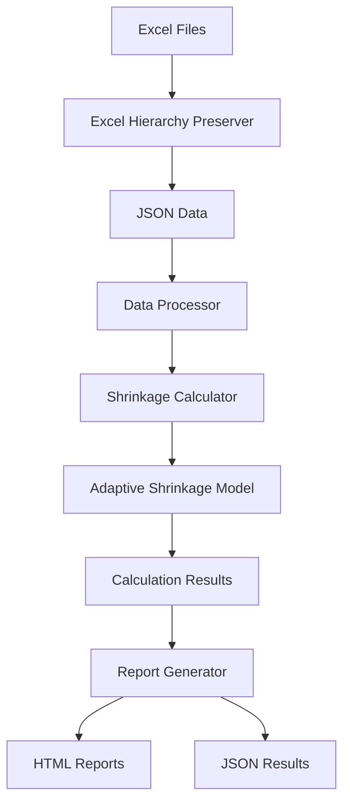
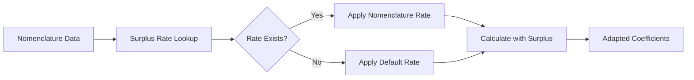

# Excel Shrinkage Calculator System Design

## 1. Overview

### 1.1 Purpose
The Excel Shrinkage Calculator System is designed to automate the process of calculating nonlinear shrinkage coefficients and preliminary shrinkage forecasts based on Excel reports. The system handles constant surplus during goods receipt with per-nomenclature accounting.

### 1.2 Scope
The system is used for:
- Calculating nonlinear shrinkage coefficients based on historical data
- Preliminary shrinkage calculation without inventory
- Generating HTML reports with calculation results
- Processing Excel reports while preserving hierarchical structure
- Accounting for constant surplus during goods receipt (per-nomenclature accounting)

### 1.3 Key Features
- High-performance processing based on Polars
- Excel hierarchy preservation (Excel ↔ JSON conversion)
- Nonlinear shrinkage coefficient calculation using exponential model: S(t) = a × (1 - e^(-b×t)) + c
- Preliminary shrinkage forecasting without inventory
- Per-nomenclature surplus accounting
- HTML report generation with detailed analysis results

## 2. System Architecture

### 2.1 Architecture Overview
The system follows a modular, JSON-centric architecture where all input data (Excel) is converted into structured JSON format before processing. This ensures consistency and enables seamless integration with AI/ML components.



### 2.2 Component Architecture

#### 2.2.1 Core Components
1. **Excel Hierarchy Preserver** (`excel_hierarchy_preserver.py`)
   - Converts Excel → JSON with structure preservation
   - Converts JSON → Excel with structure restoration
   - Handles multi-layer reports with grouping

2. **Data Processor** (`data_processor.py`)
   - Iterates through datasets
   - Validates data using Pydantic models
   - Coordinates calculation models
   - Collects results

3. **Shrinkage Calculator** (`shrinkage_calculator.py`)
   - Implements mathematical models for coefficient calculation
   - Supports exponential, linear, and polynomial models
   - Calculates preliminary shrinkage forecasts

4. **Adaptive Shrinkage Model** (`adaptive_shrinkage_calculator.py`)
   - Self-learning model that adapts to different conditions
   - Accounts for constant surplus with per-nomenclature accounting
   - Product type-specific coefficient adaptation

5. **Shrinkage System** (`shrinkage_system.py`)
   - Main orchestrator coordinating components
   - Manages configuration and state
   - Handles per-nomenclature surplus rates

6. **HTML Reporter** (`shrinkage_html_reporter.py`)
   - Generates interactive HTML reports
   - Provides filtering, sorting, and visualization
   - Creates detailed reports for each nomenclature

#### 2.2.2 Data Models
- **NomenclatureRow** (`data_models.py`): Validates data rows with fields for name, initial balance, incoming, outgoing, final balance, and storage days

#### 2.2.3 Supporting Components
- **Configuration Manager** (`config.py`): Manages system configuration
- **Logger** (`logger_config.py`): Handles structured logging
- **Reporting Module** (`reporting.py`): Coordinates report generation

## 3. Data Flow

### 3.1 Primary Data Flow
1. User provides Excel file with shrinkage data
2. Excel Hierarchy Preserver converts Excel to JSON while preserving structure
3. Data Processor validates data and prepares it for calculation
4. Shrinkage System coordinates calculation using appropriate models
5. Adaptive Shrinkage Model calculates coefficients with per-nomenclature surplus accounting
6. Results are processed by Report Generator
7. HTML reports and JSON results are generated

### 3.2 Per-Nomenclature Surplus Accounting Flow


## 4. API Endpoints/Interfaces

### 4.1 Core System Interface
```python
class ShrinkageSystem:
    def __init__(self, custom_config: Optional[Dict[str, Any]] = None)
    def set_surplus_rate(self, surplus_rate: float, nomenclature: Optional[str] = None)
    def get_surplus_rate(self, nomenclature: Optional[str] = None) -> float
    def process_dataset(self, dataset: pd.DataFrame, source_filename: str, use_adaptive: bool = False) -> Dict[str, Any]
```

### 4.2 Adaptive Model Interface
```python
class AdaptiveShrinkageModel:
    def __init__(self, initial_learning_rate: float = 0.1)
    def set_surplus_rate(self, surplus_rate: float, nomenclature: Optional[str] = None)
    def get_surplus_rate(self, nomenclature: Optional[str] = None) -> float
    def adapt_coefficients(self, new_data: Dict[str, Any], environmental_conditions: Optional[Dict[str, float]] = None, product_type: Optional[str] = None, date: Optional[datetime] = None, nomenclature: Optional[str] = None) -> Dict[str, float]
```

## 5. Data Models

### 5.1 Nomenclature Data Model
| Field | Type | Description |
|-------|------|-------------|
| name | str | Nomenclature position name |
| initial_balance | PositiveFloat | Initial balance value |
| incoming | float (≥0) | Incoming goods amount |
| outgoing | float (≥0) | Outgoing goods amount |
| final_balance | float (≥0) | Final balance value |
| storage_days | PositiveInt | Storage period in days |

### 5.2 Calculation Results Model
| Field | Type | Description |
|-------|------|-------------|
| Номенклатура | str | Nomenclature name |
| a, b, c | float | Exponential model coefficients |
| Точность | float | Model accuracy percentage |
| Модель | str | Model type used |
| Дней_хранения | int | Storage days |
| Учет_излишка | str (optional) | Surplus accounting info |

## 6. Business Logic

### 6.1 Shrinkage Calculation Logic
The system implements multiple mathematical models for shrinkage calculation:

1. **Exponential Model**: S(t) = a × (1 - e^(-b×t)) + c×t
2. **Linear Model**: S(t) = a×t + b
3. **Polynomial Model**: S(t) = a×t² + b×t + c

The exponential model is the primary model as it best represents the nonlinear nature of shrinkage over time.

### 6.2 Per-Nomenclature Surplus Accounting
The system accounts for constant surplus during goods receipt with the following logic:
1. Each nomenclature can have a specific surplus rate
2. If no specific rate exists, a default rate is used
3. Surplus is applied to incoming goods: `corrected_incoming = incoming × (1 + surplus_rate)`
4. Calculations use corrected values for accuracy

### 6.3 Adaptive Model Logic
The adaptive model adjusts coefficients based on:
- Product type (fresh, smoked, dried, etc.)
- Seasonal factors
- Environmental conditions
- Historical performance data

Product type determination is based on keywords in nomenclature names:
- 'С/С', 'СЛАБОСОЛ', 'СЛАБ.СОЛ' → fish_salt_cured
- 'Г/К', 'ГОРЯЧ', 'HOT' → fish_hot_smoked
- 'Х/К', 'ХОЛОД', 'COLD' → fish_cold_smoked
- 'КОПЧ', 'SMOKED' → fish_smoked
- 'СУШ', 'DRIED', 'ВЯЛ', 'CURED' → fish_dried
- Default → fish_fresh

### 6.4 Preliminary Shrinkage Calculation
For forecasting without inventory:
```
predicted_shrinkage = current_balance × shrinkage_rate
final_balance = current_balance - predicted_shrinkage
```

Where shrinkage_rate is derived from the exponential model: S(t) = a × (1 - e^(-b×t)) + c×t

## 7. Excel Processing

### 7.1 Excel to JSON Conversion
The Excel Hierarchy Preserver handles:
- Reading Excel files (.xlsx, .xlsm, .xls)
- Preserving sheet structure and data
- Maintaining row/column grouping information
- Extracting formatting information
- Converting to structured JSON format

### 7.2 JSON to Excel Conversion
The reverse process ensures:
- Exact restoration of Excel structure
- Preservation of grouping and formatting
- Identity with original file as primary success criterion

## 8. Reporting

### 8.1 HTML Reports
Generated reports include:
- Interactive filtering and sorting
- Visualizations of shrinkage patterns
- Detailed nomenclature breakdown
- Accuracy metrics for each calculation
- Summary statistics

### 8.2 JSON Results
Structured output includes:
- Calculated coefficients for each nomenclature
- Model accuracy metrics
- Processing metadata
- Configuration information

## 9. Testing Strategy

### 9.1 Unit Testing
Components tested individually:
- Excel hierarchy preservation
- Data validation models
- Shrinkage calculation algorithms
- Adaptive model functionality
- Per-nomenclature surplus accounting

### 9.2 Integration Testing
End-to-end workflows tested:
- Full Excel processing pipeline
- JSON conversion fidelity
- Report generation accuracy
- Surplus accounting integration

### 9.3 Real Data Testing
All tests based on actual data structures from the 'исходные_данные' directory rather than synthetic data.

## 10. Technology Stack

### 10.1 Core Technologies
- **Python 3.7+**: Main programming language
- **Polars**: High-performance data processing
- **Pandas**: Data manipulation and compatibility
- **NumPy**: Numerical computing
- **SciPy**: Scientific computing and optimization

### 10.2 Excel Processing
- **OpenPyXL**: Reading/writing .xlsx/.xlsm files
- **xlrd**: Reading .xls files
- **xlsxwriter**: Writing formatted Excel files

### 10.3 Data Validation
- **Pydantic**: Data model validation

### 10.4 Reporting and Visualization
- **Plotly**: Interactive visualizations
- **Matplotlib**: Static visualizations

### 10.5 Logging
- **Loguru**: Structured logging

### 10.6 Testing
- **Pytest**: Testing framework