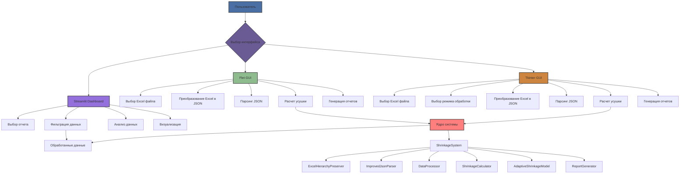

# Настройка логической последовательности и обновление графического интерфейса

## 1. Обзор

В этом документе описан дизайн улучшения логической последовательности операций в системе расчета коэффициентов усушки и обновления компонентов графического интерфейса для обеспечения согласованного и интуитивно понятного пользовательского опыта во всех интерфейсах.

Система в настоящее время имеет три основных интерфейса:
1. Flet GUI (`src/gui_complete.py`) - Современный графический интерфейс
2. Tkinter GUI (`src/tkinter_gui.py`) - Расширенный настольный интерфейс с дополнительными утилитами
3. Streamlit Dashboard (`src/dashboard.py`) - Веб-дашборд для анализа результатов

Все интерфейсы используют общее ядро системы для обработки данных.

## 2. Архитектура системы

### 2.1 Текущая архитектура

Система следует модульной архитектуре с четким разделением между:
- **Слой основной логики**: Содержит основную бизнес-логику для расчета усушки
- **Слой интерфейса**: Множественные реализации графического интерфейса, взаимодействующие с ядром
- **Слой данных**: Обрабатывает сохранение и извлечение данных
- **Слой конфигурации**: Управляет настройками и предпочтениями системы

### 2.2 Поток данных

## 3. Улучшения логической последовательности

### 3.1 Улучшение последовательности в ядре системы

Логическая последовательность операций в ядре системы должна быть стандартизирована и улучшена для обеспечения согласованности во всех интерфейсах.

#### 3.1.1 ShrinkageSystem (Оркестратор)

Текущая последовательность:
1. Валидация данных
2. Настройка обработки
3. Обработка набора данных
4. Генерация результатов
5. Сохранение в базу данных
6. Генерация отчетов

Предлагаемые улучшения:
1. Валидация входных данных и предварительная обработка
2. Валидация конфигурации
3. Инициализация обработки данных
4. Последовательная обработка данных
5. Валидация результатов
6. Операции с базой данных
7. Генерация отчетов
8. Очистка и финализация

#### 3.1.2 Улучшение последовательности DataProcessor

Текущая последовательность:
1. Валидация данных строки
2. Подготовка данных для расчета
3. Анализ недостач из инвентаризации
4. Расчет коэффициентов

Предлагаемые улучшения:
1. Предварительная обработка и валидация данных
2. Настройка конфигурации
3. Последовательная обработка каждой строки данных:
   - Валидация строки
   - Подготовка данных
   - Анализ инвентаризации
   - Расчет
   - Валидация результата
4. Агрегация результатов
5. Финальная валидация

#### 3.1.3 Улучшение последовательности ReportGenerator

Текущая последовательность:
1. Настройка директории
2. Генерация HTML отчетов
3. Генерация сводной статистики

Предлагаемые улучшения:
1. Валидация конфигурации
2. Настройка директории и файлов
3. Последовательная генерация отчетов:
   - Отчеты по коэффициентам усушки
   - Отчеты об ошибках расчета
   - Отчеты по позициям без инвентаризации
   - Предварительные расчеты (при необходимости)
   - Сводные отчеты
4. Генерация индекса
5. Финальная валидация

### 3.2 Улучшение последовательности GUI

#### 3.2.1 Последовательность Flet GUI

Текущая последовательность:
1. Выбор Excel файла
2. Преобразование Excel в JSON
3. Парсинг JSON
4. Расчет усушки
5. Генерация отчетов

Предлагаемые улучшения:
1. Выбор файла и валидация
2. Настройка предварительной обработки
3. Последовательная обработка с подробной обратной связью:
   - Этап 1/5: Преобразование Excel в JSON
   - Этап 2/5: Парсинг JSON
   - Этап 3/5: Валидация данных
   - Этап 4/5: Расчет усушки
   - Этап 5/5: Генерация отчетов
4. Представление результатов
5. Действия после обработки

#### 3.2.2 Последовательность Tkinter GUI

Текущая последовательность:
1. Выбор Excel файла
2. Выбор режима обработки
3. Преобразование Excel в JSON
4. Парсинг JSON
5. Расчет усушки
6. Генерация отчетов

Предлагаемые улучшения:
1. Выбор файла и валидация
2. Выбор режима и конфигурация
3. Настройка предварительной обработки
4. Последовательная обработка с подробной обратной связью:
   - Этап 1/6: Преобразование Excel в JSON
   - Этап 2/6: Парсинг JSON
   - Этап 3/6: Валидация данных
   - Этап 4/6: Настройка обработки
   - Этап 5/6: Расчет усушки
   - Этап 6/6: Генерация отчетов
5. Представление результатов
6. Действия после обработки

#### 3.2.3 Последовательность Streamlit Dashboard

Текущая последовательность:
1. Выбор отчета
2. Фильтрация данных
3. Анализ и визуализация

Предлагаемые улучшения:
1. Выбор отчета и валидация
2. Загрузка и валидация данных
3. Последовательный анализ:
   - Этап 1/4: Фильтрация данных
   - Этап 2/4: Статистический анализ
   - Этап 3/4: Генерация визуализаций
   - Этап 4/4: Генерация сводки
4. Представление результатов

## 4. План улучшения графического интерфейса

### 4.1 Единый пользовательский опыт

Все интерфейсы GUI должны обеспечивать согласованный пользовательский опыт с:
- Похожей терминологией и маркировкой
- Согласованными цветовыми схемами и стилем
- Единообразными механизмами обратной связи
- Стандартизированной обработкой ошибок
- Согласованной индикацией прогресса

### 4.2 Улучшения Flet GUI

#### 4.2.1 Визуальные улучшения
- Улучшенные индикаторы прогресса с подробной информацией об этапах
- Улучшенные сообщения об ошибках с полезной обратной связью
- Лучший адаптивный дизайн для разных размеров экранов
- Согласованный стиль с интерфейсом Tkinter

#### 4.2.2 Функциональные улучшения
- Подробное пошаговое отображение прогресса
- Улучшенная валидация файлов перед обработкой
- Лучшая интеграция с управлением настройками
- Улучшенная функциональность ИИ-чата
- Интеграция отчетов:
  - Отчет по коэффициентам усушки
  - Отчет об ошибках расчета
  - Отчет по позициям без инвентаризации
  - Предварительный расчет (при необходимости)
- Кнопки открытия отчетов после завершения расчета
- Автоматическое открытие отчетов при включенной настройке

### 4.3 Улучшения Tkinter GUI

#### 4.3.1 Визуальные улучшения
- Модернизированный стиль с обновленными цветовыми схемами
- Улучшенная организация макета
- Лучший адаптивный дизайн
- Согласованный стиль с интерфейсом Flet

#### 4.3.2 Функциональные улучшения
- Улучшенное отслеживание прогресса с подробной информацией об этапах
- Улучшенный интерфейс управления настройками
- Лучшая обработка и отчетность об ошибках
- Улучшенный ИИ-чат с лучшим пониманием контекста
- Интеграция отчетов:
  - Отчет по коэффициентам усушки
  - Отчет об ошибках расчета
  - Отчет по позициям без инвентаризации
  - Предварительный расчет (при необходимости)
- Кнопки открытия отчетов после завершения расчета
- Автоматическое открытие отчетов при включенной настройке

### 4.4 Улучшения Streamlit Dashboard

#### 4.4.1 Визуальные улучшения
- Улучшенные возможности визуализации данных
- Улучшенные механизмы фильтрации
- Лучший адаптивный дизайн
- Согласованный стиль с другими интерфейсами

#### 4.4.2 Функциональные улучшения
- Улучшенные возможности анализа данных
- Лучшие функции сравнения отчетов
- Улучшенная функциональность экспорта
- Улучшенные руководства и подсказки для пользователей
- Интеграция отчетов:
  - Отчет по коэффициентам усушки
  - Отчет об ошибках расчета
  - Отчет по позициям без инвентаризации
  - Сводная статистика по расчетам
- Возможность выбора и анализа различных типов отчетов
- Фильтрация данных по типам отчетов

## 5. Улучшение управления настройками

### 5.1 Единая структура настроек

Реализация комплексной структуры настроек, организованных по категориям:
1. **Общие настройки**: Тип модели, период расчета, порог точности
2. **Настройки интерфейса**: Тема, язык, размер окна
3. **Расширенные настройки**: Производительность, логирование, управление данными
4. **Настройки интеграции**: ИИ-чат, внешние сервисы
5. **Настройки безопасности**: Защита паролем, шифрование

### 5.2 Хранение настроек

- Хранение настроек в формате JSON в директории 'результаты/'
- Реализация поддержки версионности для настроек
- Использование отдельных файлов для разных категорий
- Реализация механизма резервного копирования для восстановления настроек

### 5.3 Валидация настроек

- Реализация комплексной валидации для всех настроек
- Предоставление четких сообщений об ошибках для недопустимых настроек
- Реализация значений по умолчанию для всех настроек
- Добавление функции сброса настроек

## 6. Дорожная карта реализации

### 6.1 Фаза 1: Улучшение ядра системы (Неделя 1-2)
- Реализация улучшенной логической последовательности в ShrinkageSystem
- Улучшение DataProcessor с последовательной обработкой
- Улучшение ReportGenerator с детальной поэтапностью
- Обновление обработки ошибок и валидации
- Расширение функциональности отчетов с различными типами данных

### 6.2 Фаза 2: Улучшение последовательности GUI (Неделя 2-3)
- Обновление Flet GUI с улучшенной последовательностью и обратной связью
- Обновление Tkinter GUI с улучшенной последовательностью и обратной связью
- Обновление Streamlit Dashboard с улучшенной последовательностью
- Реализация унифицированной отчетности о прогрессе
- Интеграция всех типов отчетов в интерфейсы GUI

### 6.3 Фаза 3: Улучшение управления настройками (Неделя 3-4)
- Реализация единой структуры настроек
- Улучшение хранения настроек и резервного копирования
- Реализация валидации настроек
- Обновление всех GUI для использования нового управления настройками

### 6.4 Фаза 4: Улучшение UI/UX (Неделя 4-5)
- Реализация визуальных улучшений во всех интерфейсах
- Обеспечение согласованного пользовательского опыта
- Улучшение обработки ошибок и обратной связи с пользователем
- Проведение пользовательского тестирования и внедрение обратной связи
- Оптимизация интерфейсов для удобного доступа к отчетам

## 7. Стратегия тестирования

### 7.1 Модульное тестирование
- Тестирование каждого этапа логической последовательности
- Валидация обработки ошибок на каждом этапе
- Тестирование валидации и хранения настроек
- Проверка согласованности между интерфейсами
- Тестирование генерации различных типов отчетов

### 7.2 Интеграционное тестирование
- Тестирование полного рабочего процесса во всех интерфейсах
- Валидация согласованности данных между этапами
- Тестирование синхронизации настроек между компонентами
- Проверка распространения и обработки ошибок
- Тестирование корректности генерации и отображения отчетов во всех интерфейсах

### 7.3 Пользовательское тестирование
- Проведение тестирования удобства использования с представительными пользователями
- Сбор обратной связи по ясности логической последовательности
- Валидация функциональности управления настройками
- Оценка общих улучшений пользовательского опыта

## 8. Преимущества

### 8.1 Улучшенный пользовательский опыт
- Более четкая обратная связь по этапам обработки
- Более интуитивная навигация по интерфейсу
- Согласованный опыт во всех интерфейсах
- Лучшая обработка ошибок и руководства
- Улучшенная система отчетов с четкой классификацией
- Быстрый доступ к различным типам отчетов

### 8.2 Улучшенная поддерживаемость
- Более четкое разделение ответственности
- Стандартизированные последовательности обработки
- Улучшенная обработка ошибок и логирование
- Лучшая организация кода и документация

### 8.3 Лучшая производительность
- Более эффективная обработка данных
- Улучшенное управление ресурсами
- Лучшее восстановление после ошибок
- Улучшенные механизмы кэширования

### 8.4 Повышенная надежность
- Более надежная обработка ошибок
- Лучшая валидация данных
- Улучшенная проверка согласованности
- Улучшенное логирование и мониторинг
- Надежная система генерации отчетов с резервным копированием