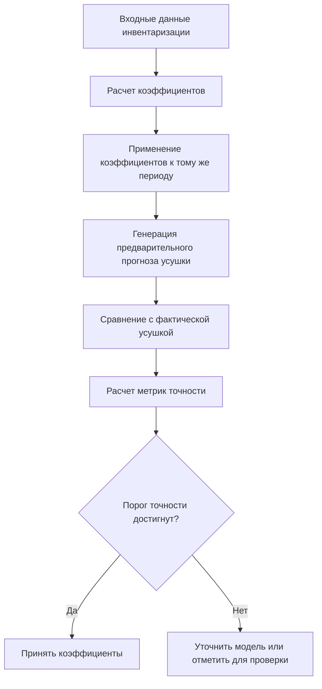
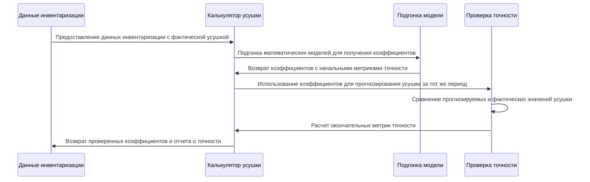

# Система верификации точности коэффициентов усушки

## 1. Обзор

Система верификации точности коэффициентов усушки обеспечивает надежность рассчитанных коэффициентов путем выполнения обратных расчетов с использованием полученных коэффициентов для проверки того, что они дают результаты, согласующиеся с исходными данными. Этот подход проверяет, что математические модели точно представляют фактические закономерности усушки, наблюдаемые в данных инвентаризации.

Система работает по принципу, что если коэффициенты рассчитаны правильно, то их применение к тому же периоду должно воспроизвести исходные результаты усушки в пределах допустимой погрешности.

## 2. Архитектура системы

### 2.1 Основные компоненты

```mermaid
graph TD
    A[Данные инвентаризации] --> B[Калькулятор усушки]
    B --> C[Расчет коэффициентов]
    C --> D[Подгонка модели]
    D --> E[Коэффициенты]
    E --> F[Проверка точности]
    F --> G[Отчет о валидации]
    
    subgraph "Процесс проверки точности"
        E --> H[Движок обратных расчетов]
        H --> I[Предварительный расчет усушки]
        I --> J[Логика сравнения]
        A --> J
        J --> K[Метрики точности]
        K --> G
    endgraph
```

### 2.2 Описание компонентов

| Компонент | Ответственность |
|-----------|----------------|
| Калькулятор усушки | Рассчитывает коэффициенты усушки с использованием различных математических моделей |
| Подгонка модели | Подгоняет математические модели к данным инвентаризации для получения коэффициентов |
| Движок обратных расчетов | Использует рассчитанные коэффициенты для прогнозирования усушки за тот же период |
| Логика сравнения | Сравнивает прогнозируемую усушку с фактической усушкой из данных инвентаризации |
| Метрики точности | Рассчитывает метрики точности, такие как R², RMSE и MAE |

## 3. Процесс проверки точности

### 3.1 Схема процесса



### 3.2 Детальные шаги

1. **Расчет коэффициентов**: Система анализирует данные инвентаризации для расчета коэффициентов усушки с использованием математических моделей (экспоненциальная, линейная, полиномиальная).

2. **Применение модели**: Рассчитанные коэффициенты затем применяются к тому же временному периоду для прогнозирования того, какой должна была быть усушка.

3. **Генерация прогноза**: Используя метод `calculate_preliminary_shrinkage`, система генерирует прогнозируемое значение усушки на основе рассчитанных коэффициентов.

4. **Сравнение**: Прогнозируемая усушка сравнивается с фактической усушкой, наблюдаемой в данных инвентаризации.

5. **Расчет метрик точности**: Система рассчитывает различные метрики точности:
   - R² (Коэффициент детерминации)
   - RMSE (Среднеквадратическая ошибка)
   - MAE (Средняя абсолютная ошибка)

6. **Решение о валидации**: На основе метрик точности система определяет, приемлемы ли коэффициенты или нуждаются в уточнении.

## 4. Математические модели

### 4.1 Экспоненциальная модель
```
S(t) = a * (1 - exp(-b*t)) + c*t
```
Где:
- S(t) - усушка в долях от начального остатка в момент времени t
- a, b, c - коэффициенты, которые необходимо определить
- t - время хранения в днях

### 4.2 Линейная модель
```
S(t) = a*t + b
```

### 4.3 Полиномиальная модель
```
S(t) = a*t² + b*t + c
```

## 5. Метрики точности

### 5.1 R² (Коэффициент детерминации)
Измеряет, насколько хорошо модель объясняет дисперсию данных:
```
R² = 1 - (SS_res / SS_tot)
```
Где:
- SS_res - сумма квадратов остатков
- SS_tot - общая сумма квадратов

### 5.2 RMSE (Среднеквадратическая ошибка)
Измеряет среднюю величину ошибки:
```
RMSE = √(Σ(прогноз - фактическое)² / n)
```

### 5.3 MAE (Средняя абсолютная ошибка)
Измеряет среднюю абсолютную разницу между прогнозируемыми и фактическими значениями:
```
MAE = Σ|прогноз - фактическое| / n
```

## 6. Детали реализации

### 6.1 Ключевые методы

#### calculate_coefficients()
- Принимает данные инвентаризации в качестве входных данных
- Подготавливает временные ряды для подгонки модели
- Подгоняет математические модели для получения коэффициентов
- Возвращает коэффициенты с метриками точности

#### calculate_preliminary_shrinkage()
- Принимает коэффициенты и применяет их для прогнозирования усушки
- Используется для проверки точности путем применения к тому же периоду
- Возвращает прогнозируемые значения усушки

#### _calculate_r_squared()
- Рассчитывает коэффициент R² для оценки модели
- Используется для определения точности подгонки коэффициентов

### 6.2 Поток данных



## 7. Критерии валидации

Система использует следующие критерии для проверки точности коэффициентов:

| Метрика | Приемлемый диапазон | Предупреждающий диапазон | Критический диапазон |
|--------|------------------|---------------|----------------|
| R² | > 0.85 | 0.7 - 0.85 | < 0.7 |
| RMSE | < 0.05 | 0.05 - 0.1 | > 0.1 |
| MAE | < 0.03 | 0.03 - 0.07 | > 0.07 |

## 8. Обработка ошибок

Система реализует несколько механизмов обработки ошибок:

1. **Валидация данных**: Обеспечивает наличие необходимых полей в данных инвентаризации
2. **Ошибки подгонки модели**: Возвращается к коэффициентам по умолчанию, когда подгонка модели не удается
3. **Пороги точности**: Помечает коэффициенты, которые не соответствуют критериям валидации
4. **Обработка исключений**: Корректно обрабатывает вычислительные ошибки

## 9. Стратегия тестирования

### 9.1 Модульные тесты
- Тестирование расчета коэффициентов с известными наборами данных
- Проверка расчета метрик точности
- Тестирование граничных случаев (нулевые/отрицательные значения, недостаток данных)

### 9.2 Интеграционные тесты
- Валидация сквозного процесса проверки точности
- Тестирование с реальными данными инвентаризации
- Проверка интеграции с базой данных для хранения метрик точности

### 9.3 Тесты производительности
- Измерение времени расчета для больших наборов данных
- Проверка эффективности использования памяти
- Тестирование масштабируемости с увеличением объема данных