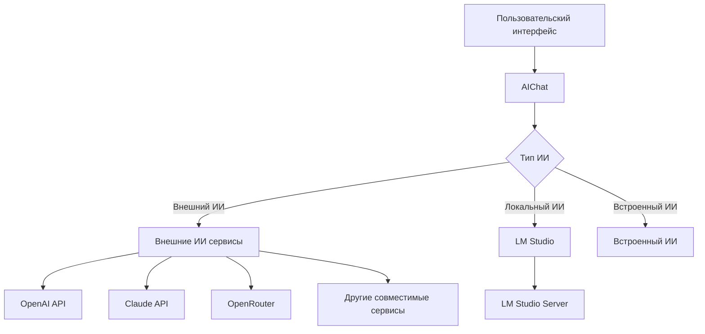

# Роль внешнего ИИ в системе расчета коэффициентов усушки

## 1. Обзор

Внешний ИИ в системе расчета коэффициентов усушки играет вспомогательную роль, предоставляя пользователям расширенные возможности для взаимодействия с системой. Внешний ИИ интегрирован через чат-интерфейс в графических интерфейсах пользователя и используется для помощи в понимании работы системы, подготовке данных и интерпретации результатов.

## 2. Архитектура интеграции

### 2.1 Компоненты интеграции



### 2.2 Класс AIChat

Основной компонент интеграции внешнего ИИ реализован в классе `AIChat`, который находится в модуле `src/core/ai_chat.py`. Этот класс предоставляет следующие функции:

- Обработку запросов пользователей
- Интеграцию с внешними ИИ сервисами через API
- Интеграцию с локальными ИИ моделями через LM Studio
- Встроенную реализацию ИИ для базовой функциональности
- Управление историей чата
- Сохранение и загрузку настроек

## 3. Скрытые паттерны и функции системы

### 3.1 Скрытые возможности базы данных

Система содержит скрытые возможности для расширенной аналитики через базу данных:

1. **AIPattern модель** - Хранит паттерны и аномалии, найденные с помощью ИИ
2. **SurplusPattern модель** - Хранит паттерны излишков для различных типов продукции
3. **PatternValidation модель** - Хранит информацию о валидации паттернов
4. **DataLineage модель** - Отслеживает происхождение данных и их трансформации
5. **MLModelRegistry модель** - Регистр моделей машинного обучения с метаданными

Эти модели указывают на скрытую функциональность системы по анализу паттернов и использованию машинного обучения для улучшения точности расчетов.

### 3.2 Адаптивная модель с секретными параметрами

Адаптивная модель (`AdaptiveShrinkageModel`) содержит скрытые параметры адаптации:

1. **Факторы адаптации**:
   - Температура (`temperature`)
   - Влажность (`humidity`)
   - Сезонность (`season`)
   - Тип продукции (`product_type`)

2. **Сезонные коэффициенты**:
   - Зима: 1.15 (повышенная усушка)
   - Весна: 1.05 (средняя усушка)
   - Лето: 1.25 (максимальная усушка)
   - Осень: 1.10 (повышенная усушка)

3. **Типы продукции с коэффициентами**:
   - Свежая рыба: базовые значения
   - Сушеная/вяленая: минимальная усушка (60% от базовой)
   - Слабосоленая: низкая усушка (70% от базовой)
   - Горячее копчение: умеренная усушка (75% от базовой)
   - Холодное копчение: средняя усушка (85% от базовой)
   - Копченая (общая): средняя усушка (80% от базовой)

## 4. Функции внешнего ИИ

### 4.1 Вспомогательные функции

Внешний ИИ в системе выполняет следующие вспомогательные функции:

1. **Объяснение работы системы**
   - Помощь в понимании принципов расчета коэффициентов усушки
   - Объяснение математических моделей, используемых в системе

2. **Работа с данными**
   - Рекомендации по подготовке данных для расчета
   - Объяснение формата Excel файлов
   - Помощь в интерпретации данных инвентаризации

3. **Интерпретация результатов**
   - Объяснение коэффициентов усушки
   - Помощь в понимании метрик точности
   - Рекомендации по улучшению точности расчетов

4. **Решение технических проблем**
   - Помощь при возникновении ошибок
   - Рекомендации по настройке системы
   - Объяснение функций конфигурации

### 4.2 Техническая реализация

Внешний ИИ интегрирован через API совместимый с OpenAI. Поддерживаемые сервисы:

- OpenAI (GPT-3.5, GPT-4)
- Claude (Anthropic)
- OpenRouter (доступ к множеству моделей через единый API)
- Другие совместимые сервисы

### 4.3 OpenRouter как провайдер ИИ

OpenRouter предоставляет доступ к более чем 400 различных моделей ИИ через единый API, включая:

- Модели OpenAI (GPT-3.5, GPT-4, GPT-4 Turbo)
- Модели Anthropic (Claude 1, Claude 2, Claude Instant)
- Модели Google (PaLM 2, Gemini Pro)
- Модели Meta (Llama 2, Llama 3, Code Llama)
- Модели Mistral AI (Mistral 7B, Mixtral 8x7B)
- Модели Alibaba (Qwen)
- Модели DeepSeek (DeepSeek)
- Модели Google (Gemma)
- И многие другие

Преимущества использования OpenRouter:

1. **Доступ к множеству моделей** - Возможность выбора из широкого спектра моделей разных поставщиков
2. **Единый API** - Единый интерфейс для работы с различными моделями
3. **Конкуренция цен** - Разные цены на разные модели позволяют выбирать оптимальное соотношение цена/качество
4. **Без привязки к одному поставщику** - Возможность переключения между моделями без изменения кода
5. **Управление ключами** - Централизованное управление API ключами для разных сервисов
6. **Автоматическое распределение нагрузки** - OpenRouter автоматически распределяет запросы между провайдерами на основе цены, пропускной способности или задержки
7. **Отказоустойчивость** - Автоматическое переключение на резервных провайдеров при сбоях
8. **Рейтинги моделей** - Доступ к рейтингам моделей на основе отзывов пользователей

Для использования OpenRouter необходимо:
- Зарегистрироваться на https://openrouter.ai
- Получить API ключ
- Пополнить баланс (при необходимости)
- Настроить параметры подключения в системе

Для работы внешнего ИИ требуется:
- Действующий API ключ
- Доступ к интернету
- Настройка в конфигурации системы

## 5. Локальные ИИ модели через LM Studio

### 5.1 Обзор интеграции

LM Studio позволяет запускать локальные ИИ модели на компьютере пользователя без подключения к интернету. Это обеспечивает:

- Полную конфиденциальность данных
- Работу без подключения к интернету
- Бесплатное использование (без API ключей)
- Быстрые ответы (при наличии подходящего оборудования)

### 5.2 Техническая реализация

Локальные ИИ модели интегрированы через LM Studio Server API, который совместим с OpenAI API. Для работы требуется:

1. Установка LM Studio (https://lmstudio.ai/)
2. Загрузка и запуск модели в LM Studio
3. Запуск сервера через интерфейс LM Studio
4. Настройка параметров подключения в системе

### 5.3 Поддерживаемые модели

Через LM Studio можно использовать любые модели, совместимые с сервером:

- Llama 2 (7B, 13B, 70B)
- Llama 3 (8B, 70B)
- Mistral (7B)
- Mixtral (8x7B)
- Qwen3 (8B, 72B) - отличная поддержка русского языка
- Gemma3 (8B) - хорошая поддержка русского языка
- ruGPT-3.5 - специализированная русскоязычная модель
- Siberian Mouse - русскоязычная модель от DeepPavlov
- Другие модели в формате GGUF

### 5.4 Настройка LM Studio

1. **Установка LM Studio**
   - Скачать с https://lmstudio.ai/
   - Установить приложение

2. **Загрузка модели**
   - Открыть LM Studio
   - Перейти во вкладку "Local Inference"
   - Найти и загрузить подходящую модель (рекомендуется Llama 3 8B)

3. **Запуск сервера**
   - Перейти во вкладку "Server"
   - Выбрать загруженную модель
   - Нажать "Start Server"
   - Запомнить порт сервера (по умолчанию 1234)

4. **Настройка в системе**
   - Включить использование локального ИИ
   - Указать URL сервера (по умолчанию http://localhost:1234/v1)
   - Выбрать модель (например, "gpt-3.5-turbo" для совместимости)

### 5.5 Рекомендации по выбору моделей в зависимости от аппаратных характеристик

Выбор подходящей модели для локального запуска зависит от аппаратных характеристик компьютера пользователя. Ниже приведены рекомендации по выбору моделей:

**Для компьютеров с ограниченными ресурсами (8 ГБ RAM, без GPU):**
- Модели с 3-4 миллиардами параметров (3B-4B)
- Рекомендуемые модели: Qwen3 4B, Gemma3 4B
- Эти модели могут работать в режиме CPU inference

**Для средних конфигураций (16 ГБ RAM, GPU с 8 ГБ VRAM):**
- Модели с 7-8 миллиардами параметров (7B-8B)
- Рекомендуемые модели: Llama 3 8B, Qwen3 8B, Gemma3 8B
- Эти модели работают эффективно как на CPU, так и на GPU

**Для мощных конфигураций (32+ ГБ RAM, GPU с 16+ ГБ VRAM):**
- Модели с 13-70 миллиардами параметров (13B-70B)
- Рекомендуемые модели: Llama 3 70B, Mixtral 8x7B
- Эти модели обеспечивают наилучшее качество, но требуют значительных ресурсов

**Рекомендации по выбору моделей для конкретных задач:**

1. **Для общих задач и вопросов:**
   - Llama 3 8B - Хорошее соотношение качества и производительности
   - Qwen3 8B - Отличная мультиязычная модель

2. **Для задач программирования:**
   - Code Llama 7B/13B - Специализированная модель для программирования
   - DeepSeek Coder 7B - Отличные способности к кодированию

3. **Для задач на русском языке:**
   - Qwen3 8B/72B - Отличная поддержка русского языка
   - Gemma3 8B - Хорошая поддержка русского языка
   - ruGPT-3.5 - Специализированная русскоязычная модель от SberDevices
   - Siberian Mouse - Русскоязычная модель от DeepPavlov
   - Russian LLaMA - Адаптированная версия LLaMA для русского языка
   - Saiga - Русскоязычная модель от AIRI

**Требования к аппаратному обеспечению:**

- **Минимальные требования:**
  - CPU: Современный процессор с 4+ ядрами
  - RAM: 8 ГБ (для моделей 3B-4B)
  - Диск: 4-6 ГБ свободного места для модели

- **Рекомендуемые требования:**
  - CPU: Процессор с 8+ ядрами
  - RAM: 16-32 ГБ
  - GPU: NVIDIA GPU с 8+ ГБ VRAM (опционально, но значительно ускоряет работу)
  - Диск: 10-70 ГБ свободного места (в зависимости от модели)

**Оптимизация производительности:**

1. Используйте квантованные версии моделей (GGUF формат) для уменьшения требований к памяти
2. Закройте другие приложения перед запуском модели для высвобождения ресурсов
3. Используйте GPU ускорение, если доступна совместимая видеокарта
4. Рассмотрите возможность использования моделей с меньшим количеством параметров при достаточном качестве

## 6. Интеграция с основной системой

### 6.1 В графическом интерфейсе Tkinter

В Tkinter GUI ИИ-чат реализован в отдельной вкладке интерфейса:
- Вкладка "ИИ-чат" содержит историю разговора и поле для ввода вопросов
- Кнопка "Отправить" отправляет вопрос в ИИ и отображает ответ
- Кнопка "Очистить" очищает историю чата
- Кнопка "Настройки ИИ" открывает диалог настроек ИИ сервисов

### 6.2 В графическом интерфейсе Flet

В Flet GUI ИИ-чат реализован в нижней части основного интерфейса:
- Область чата отображает историю разговора
- Поле ввода позволяет задавать вопросы ИИ
- Кнопка отправки сообщения
- Кнопка очистки чата
- Кнопка настроек ИИ в заголовке интерфейса

## 7. Взаимодействие с пользователем

### 7.1 История чата

Система сохраняет историю чата в файле `результаты/ai_chat_history.json`, что позволяет:
- Сохранять контекст разговора
- Повторно использовать полезную информацию
- Анализировать типичные вопросы пользователей

### 7.2 Настройки ИИ

Настройки ИИ сохраняются в файле `результаты/ai_chat_settings.json` и включают:
- Включение/выключение внешнего ИИ
- Включение/выключение локального ИИ
- API ключ для внешнего сервиса
- Выбор модели ИИ
- Базовый URL API для внешнего ИИ
- Базовый URL для локального ИИ сервера

## 8. Преимущества и ограничения

### 8.1 Преимущества

1. **Расширенные возможности помощи пользователям**
   - Более точные и подробные ответы по сравнению с встроенным ИИ
   - Возможность обработки сложных запросов
   - Адаптация к стилю общения пользователя

2. **Гибкость интеграции**
   - Поддержка различных ИИ сервисов
   - Возможность выбора модели
   - Настройка параметров запросов

3. **Сохранение контекста**
   - История чата помогает ИИ лучше понимать запросы пользователя
   - Возможность ссылаться на предыдущие сообщения

### 8.2 Ограничения

1. **Зависимость от интернета (для внешнего ИИ)**
   - Требуется стабильное подключение к интернету
   - Задержки при обработке запросов

2. **Стоимость использования (для внешнего ИИ)**
   - Расходы на API вызовы внешних сервисов
   - Необходимость управления лимитами использования

3. **Конфиденциальность данных (для внешнего ИИ)**
   - Передача данных во внешние сервисы
   - Необходимость доверия к поставщику ИИ

4. **Требования к оборудованию (для локального ИИ)**
   - Необходимость мощного компьютера для запуска моделей
   - Потребление оперативной памяти (от 4 ГБ до 32 ГБ в зависимости от модели)
   - Возможная нагрузка на процессор/видеокарту

## 9. Скрытые возможности и рекомендации по использованию

### 9.1 Скрытые возможности системы

1. **Аналитика паттернов** - Система собирает и анализирует паттерны поведения пользователей и паттерны данных для улучшения точности расчетов
2. **Адаптивные модели** - Система автоматически адаптирует коэффициенты усушки на основе сезонных факторов, типа продукции и условий хранения
3. **Машинное обучение** - Скрытая функциональность позволяет системе обучаться на основе исторических данных и улучшать точность прогнозов
4. **Отслеживание происхождения данных** - Система отслеживает полный путь данных от источника до результата для обеспечения качества

### 9.2 Рекомендации по использованию

1. **Используйте встроенный ИИ для общих вопросов** - он работает без подключения к интернету
2. **Подключайте внешний ИИ для сложных запросов** - более мощные модели могут дать более точные ответы
3. **Используйте локальный ИИ через LM Studio для конфиденциальности** - ваши данные не покидают компьютер
4. **Сохраняйте историю чата** - она может быть полезна для обучения системы
5. **Регулярно обновляйте API ключи** - для обеспечения безопасности
6. **Используйте сезонные коэффициенты** - учитывайте сезонность при анализе данных усушки
7. **Анализируйте паттерны** - изучайте отчеты о паттернах для улучшения точности расчетов
8. **Применяйте адаптивные модели** - используйте адаптивные модели для учета внешних факторов

## 10. Технические изменения для реализации

### 10.1 Изменения в классе AIChat

Для реализации поддержки LM Studio необходимо внести следующие изменения в класс `AIChat`:

1. Добавить новые параметры конфигурации:
   - `enable_local_ai` (bool) - включение локального ИИ
   - `local_ai_model` (str) - название модели для локального ИИ
   - `local_ai_base_url` (str) - URL сервера LM Studio
   - `enable_openrouter` (bool) - включение использования OpenRouter
   - `openrouter_api_key` (str) - API ключ для OpenRouter
   - `openrouter_model` (str) - модель для использования через OpenRouter

2. Добавить метод `get_local_ai_response()` для обработки запросов к локальному ИИ

3. Обновить логику выбора типа ИИ в методе `get_response()`
   - Добавить поддержку OpenRouter как отдельного типа ИИ
   - Реализовать метод `get_openrouter_response()` для обработки запросов к OpenRouter

### 10.2 Изменения в конфигурации

Необходимо добавить новые параметры валидации в `CONFIG_VALIDATION_RULES`:

```python
'enable_local_ai': {
    'type': bool,
    'required': True
},
'enable_openrouter': {
    'type': bool,
    'required': True
},
'enable_ai_coefficient_calculation': {
    'type': bool,
    'required': True
},
'ai_explanation_level': {
    'type': str,
    'allowed_values': ['minimal', 'standard', 'detailed'],
    'required': True
},
'ai_anomaly_threshold': {
    'type': float,
    'min': 0.0,
    'max': 100.0,
    'required': True
},
'local_ai_model': {
    'type': str,
    'required': True
},
'local_ai_base_url': {
    'type': str,
    'required': True
},
'openrouter_api_key': {
    'type': str,
    'required': False
},
'openrouter_model': {
    'type': str,
    'required': False
}
```

### 10.3 Изменения в настройках

В интерфейсе настроек ИИ необходимо добавить:

1. Новый переключатель для включения локального ИИ
2. Поле ввода для URL сервера LM Studio
3. Выбор модели для локального ИИ
4. Новый переключатель для включения OpenRouter
5. Поле ввода для API ключа OpenRouter
6. Выбор модели для OpenRouter
7. Логику, предотвращающую одновременное включение нескольких типов ИИ

Также необходимо обновить конфигурацию по умолчанию в `DEFAULT_CONFIG`:

```python
# === НАСТРОЙКИ ИИ ===
# Включить использование внешнего ИИ
'enable_external_ai': False,

# Включить использование локального ИИ
'enable_local_ai': False,

# Включить использование OpenRouter
'enable_openrouter': False,

# Включить использование ИИ для расчета коэффициентов
'enable_ai_coefficient_calculation': False,

# Уровень детализации объяснений ИИ
'ai_explanation_level': 'standard',  # 'minimal', 'standard', 'detailed'

# Порог аномалий для выявления ИИ (%)
'ai_anomaly_threshold': 5.0,

# API ключ для внешнего ИИ сервиса
'external_ai_api_key': '',

# Модель ИИ для использования с внешним ИИ
'external_ai_model': 'gpt-3.5-turbo',

# Базовый URL для внешнего ИИ API
'external_ai_base_url': 'https://api.openai.com/v1',

# API ключ для OpenRouter
'openrouter_api_key': '',

# Модель ИИ для использования с OpenRouter
'openrouter_model': 'openai/gpt-3.5-turbo',

# Базовый URL для OpenRouter API
'openrouter_base_url': 'https://openrouter.ai/api/v1',

# Модель ИИ для использования с локальным ИИ
'local_ai_model': 'gpt-3.5-turbo',

# Базовый URL для локального ИИ сервера
'local_ai_base_url': 'http://localhost:1234/v1',
```

### 10.4 Интеграция в графический интерфейс

В обоих графических интерфейсах (Tkinter и Flet) необходимо обновить диалог настроек ИИ:

1. **Добавить новую вкладку или секцию "Локальный ИИ"**
   - Переключатель "Использовать локальный ИИ"
   - Поле ввода "URL сервера LM Studio" с значением по умолчанию "http://localhost:1234/v1"
   - Выпадающий список с выбором модели
   - Кнопка "Проверить подключение" для тестирования соединения с сервером

2. **Добавить секцию "ИИ-ассистент для расчета коэффициентов"**
   - Переключатель "Использовать ИИ для расчета коэффициентов"
   - Выпадающий список "Уровень детализации объяснений" (минимальный, стандартный, подробный)
   - Поле ввода "Порог аномалий (%)" с значением по умолчанию 5.0
   - Кнопка "Тест анализа данных" для проверки функциональности

3. **Обновить логику переключения между типами ИИ**
   - При включении локального ИИ автоматически отключать внешний ИИ
   - При включении внешнего ИИ автоматически отключать локальный ИИ
   - Добавить предупреждение при попытке одновременного включения обоих типов

4. **Добавить статус сервера LM Studio**
   - Индикатор состояния (подключен/не подключен)
   - Кнопка для быстрого запуска LM Studio (если возможно)
   - Информация о загруженной модели и её параметрах

5. **Добавить настройки OpenRouter**
   - Переключатель "Использовать OpenRouter"
   - Поле ввода "API ключ OpenRouter"
   - Выпадающий список с выбором модели из доступных через OpenRouter
   - Кнопка "Проверить подключение" для тестирования соединения с OpenRouter
   - Добавить информацию о стоимости использования выбранной модели
   - Предоставить ссылку на документацию OpenRouter для получения дополнительной информации

6. **Интеграция в результаты расчета**
   - Панель с рекомендациями ИИ в результатах расчета
   - Кнопка "Объяснить расчет" для каждого коэффициента
   - Визуализация аномалий, выявленных ИИ
   - Экспорт объяснений ИИ в отчет

### 10.5 Метод get_local_ai_response

Новый метод должен:

1. Подготавливать историю чата аналогично `get_external_ai_response()`
2. Отправлять запрос к серверу LM Studio по адресу `local_ai_base_url`
3. Использовать `local_ai_model` вместо `external_ai_model`
4. Не требовать API ключа
5. Обрабатывать ошибки подключения к локальному серверу

### 10.6 Метод get_openrouter_response

Новый метод должен:

1. Подготавливать историю чата аналогично `get_external_ai_response()`
2. Отправлять запрос к серверу OpenRouter по адресу `openrouter_base_url`
3. Использовать `openrouter_model` для выбора модели
4. Требовать API ключ `openrouter_api_key` для аутентификации
5. Обрабатывать ошибки подключения к OpenRouter
6. Поддерживать различные модели, доступные через OpenRouter

### 10.6 Интеграция с системой расчета коэффициентов

Для интеграции ИИ-ассистента с основной системой расчета коэффициентов необходимо:

1. **Модифицировать класс ShrinkageSystem**:
   - Добавить зависимость от AIChat
   - Добавить метод `enhance_calculation_with_ai()`
   - Добавить метод `generate_ai_explanation()`

2. **Обновить метод process_dataset()**:
   - Добавить вызов ИИ-анализа при включенной опции
   - Интегрировать рекомендации ИИ в процесс расчета
   - Сохранять объяснения ИИ в результатах

3. **Расширить отчеты**:
   - Добавить секцию с объяснениями ИИ
   - Включить визуализацию аномалий
   - Добавить рекомендации по улучшению точности

Пример интеграции в ShrinkageSystem:

```python
class ShrinkageSystem:
    def __init__(self, custom_config: Optional[Dict[str, Any]] = None):
        # ... существующий код ...
        
        # Инициализация ИИ-ассистента (если включено)
        if self.config.get('enable_ai_coefficient_calculation', False):
            self.ai_assistant = AIChat(self.config)
        else:
            self.ai_assistant = None
    
    def process_dataset(self, dataset: pd.DataFrame, source_filename: str,
                       use_adaptive: bool = False) -> Dict[str, Any]:
        # ... существующий код ...
        
        # ИИ-анализ данных (если включено)
        ai_analysis = None
        if self.ai_assistant and self.config.get('enable_ai_coefficient_calculation', False):
            ai_analysis = self.ai_assistant.analyze_shrinkage_data(source_filename, dataset)
            log.info("Выполнен ИИ-анализ данных инвентаризации")
        
        # ... продолжение расчета ...
        
        # Добавляем ИИ-анализ в результаты
        result['ai_analysis'] = ai_analysis
        
        return result
```

4. **Обновить генерацию отчетов**:
   - Интегрировать объяснения ИИ в HTML-отчеты
   - Добавить визуальные элементы для рекомендаций ИИ
   - Создать отдельный отчет с полным ИИ-анализом

### 10.5 Пример реализации метода get_local_ai_response

```python
def get_local_ai_response(self, user_message: str) -> str:
    """
    Получает ответ от локального ИИ через LM Studio.
    
    Args:
        user_message (str): Сообщение пользователя.
        
    Returns:
        str: Ответ локального ИИ.
    """
    try:
        # Подготавливаем историю чата для отправки локальному ИИ
        messages = []
        
        # Добавляем системное сообщение
        messages.append({
            "role": "system",
            "content": "Вы - помощник по системе расчета коэффициентов усушки. Помогайте пользователям с вопросами о работе системы, подготовке данных и интерпретации результатов."
        })
        
        # Добавляем последние сообщения из истории
        recent_messages = self.chat_history[-10:] if len(self.chat_history) > 10 else self.chat_history
        for msg in recent_messages:
            if msg["role"] != "system":
                messages.append({
                    "role": msg["role"],
                    "content": msg["content"]
                })
        
        # Добавляем текущее сообщение пользователя
        messages.append({
            "role": "user",
            "content": user_message
        })
        
        # Подготавливаем тело запроса
        payload = {
            "model": self.local_ai_model,
            "messages": messages,
            "temperature": 0.7,
            "max_tokens": 500
        }
        
        # Отправляем запрос к локальному серверу LM Studio
        response = requests.post(
            f"{self.local_ai_base_url}/chat/completions",
            json=payload,
            timeout=60  # Увеличенный таймаут для локальных моделей
        )
        
        # Проверяем статус ответа
        response.raise_for_status()
        
        # Извлекаем ответ из JSON
        response_data = response.json()
        ai_response = response_data["choices"][0]["message"]["content"].strip()
        
        return ai_response
        
    except requests.exceptions.ConnectionError:
        log.error("Ошибка подключения к локальному ИИ серверу LM Studio")
        return "Ошибка подключения к локальному ИИ серверу LM Studio. Убедитесь, что сервер запущен и доступен по указанному адресу."
    except requests.exceptions.Timeout:
        log.error("Таймаут при запросе к локальному ИИ серверу LM Studio")
        return "Таймаут при запросе к локальному ИИ серверу. Модель может быть загружена или перегружена. Попробуйте повторить запрос позже."
    except requests.exceptions.RequestException as e:
        log.error(f"Ошибка сети при запросе к локальному ИИ: {e}")
        return f"Ошибка сети при взаимодействии с локальным ИИ: {str(e)}"
    except KeyError as e:
        log.error(f"Ошибка обработки ответа от локального ИИ: {e}")
        return "Ошибка обработки ответа от локального ИИ. Сервер вернул некорректный формат ответа."
    except Exception as e:
        log.error(f"Неожиданная ошибка при получении ответа от локального ИИ: {e}")
        return f"Произошла ошибка при взаимодействии с локальным ИИ: {str(e)}"
```

### 10.7 Пример реализации метода get_openrouter_response

```python
def get_openrouter_response(self, user_message: str) -> str:
    """
    Получает ответ от ИИ через OpenRouter.
    
    Args:
        user_message (str): Сообщение пользователя.
        
    Returns:
        str: Ответ ИИ через OpenRouter.
    """
    try:
        # Подготавливаем историю чата для отправки в OpenRouter
        messages = []
        
        # Добавляем системное сообщение
        messages.append({
            "role": "system",
            "content": "Вы - помощник по системе расчета коэффициентов усушки. Помогайте пользователям с вопросами о работе системы, подготовке данных и интерпретации результатов."
        })
        
        # Добавляем последние сообщения из истории
        recent_messages = self.chat_history[-10:] if len(self.chat_history) > 10 else self.chat_history
        for msg in recent_messages:
            if msg["role"] != "system":
                messages.append({
                    "role": msg["role"],
                    "content": msg["content"]
                })
        
        # Добавляем текущее сообщение пользователя
        messages.append({
            "role": "user",
            "content": user_message
        })
        
        # Подготавливаем тело запроса
        payload = {
            "model": self.openrouter_model,
            "messages": messages,
            "temperature": 0.7,
            "max_tokens": 500
        }
        
        # Заголовки для запроса к OpenRouter
        headers = {
            "Authorization": f"Bearer {self.openrouter_api_key}",
            "HTTP-Referer": "Shrinkage Calculation System",
            "X-Title": "Shrinkage Calculation System"
        }
        
        # Отправляем запрос к OpenRouter
        response = requests.post(
            f"{self.openrouter_base_url}/chat/completions",
            json=payload,
            headers=headers,
            timeout=30
        )
        
        # Проверяем статус ответа
        response.raise_for_status()
        
        # Извлекаем ответ из JSON
        response_data = response.json()
        ai_response = response_data["choices"][0]["message"]["content"].strip()
        
        return ai_response
        
    except requests.exceptions.ConnectionError:
        log.error("Ошибка подключения к OpenRouter")
        return "Ошибка подключения к OpenRouter. Проверьте ваше интернет-соединение и правильность API ключа."
    except requests.exceptions.Timeout:
        log.error("Таймаут при запросе к OpenRouter")
        return "Таймаут при запросе к OpenRouter. Сервер может быть перегружен. Попробуйте повторить запрос позже."
    except requests.exceptions.RequestException as e:
        log.error(f"Ошибка сети при запросе к OpenRouter: {e}")
        return f"Ошибка сети при взаимодействии с OpenRouter: {str(e)}"
    except KeyError as e:
        log.error(f"Ошибка обработки ответа от OpenRouter: {e}")
        return "Ошибка обработки ответа от OpenRouter. Сервер вернул некорректный формат ответа."
    except Exception as e:
        log.error(f"Неожиданная ошибка при получении ответа от OpenRouter: {e}")
        return f"Произошла ошибка при взаимодействии с OpenRouter: {str(e)}"
```

## 11. Расширенные возможности ИИ для расчета коэффициентов усушки

### 11.1 ИИ-ассистент для расчета коэффициентов

Для повышения точности и улучшения понимания расчетов коэффициентов усушки можно реализовать расширенную функцию ИИ, которая:

1. **Анализирует исходные данные** - ИИ может читать и анализировать содержимое Excel файлов с данными инвентаризации
2. **Применяет бизнес-логику** - ИИ использует знания о бизнес-логике системы для более точного расчета коэффициентов
3. **Объясняет расчеты** - ИИ предоставляет подробные объяснения того, как были получены коэффициенты
4. **Выявляет аномалии** - ИИ может обнаруживать аномальные данные и предлагать решения

### 11.2 Техническая реализация

Для реализации этой функции необходимо:

1. **Добавить новую опцию в настройках ИИ**:
   - Переключатель "Использовать ИИ для расчета коэффициентов"
   - Выбор уровня детализации объяснений
   - Настройка порогов для выявления аномалий

2. **Расширить класс AIChat**:
   - Добавить метод `analyze_shrinkage_data()`
   - Добавить метод `calculate_coefficients_with_ai()`
   - Добавить метод `explain_calculation_process()`

3. **Интегрировать с основной системой**:
   - Модифицировать `ShrinkageSystem` для использования ИИ-ассистента
   - Добавить передачу данных в ИИ при расчете коэффициентов
   - Реализовать отображение объяснений в интерфейсе

### 11.3 Пример реализации метода анализа данных

```python
def analyze_shrinkage_data(self, file_path: str, dataset: pd.DataFrame) -> Dict[str, Any]:
    """
    Анализирует данные инвентаризации с помощью ИИ.
    
    Args:
        file_path (str): Путь к файлу с исходными данными
        dataset (pd.DataFrame): Данные инвентаризации
        
    Returns:
        Dict[str, Any]: Анализ данных с рекомендациями
    """
    try:
        # Подготавливаем данные для отправки ИИ
        analysis_request = {
            "task": "shrinkage_data_analysis",
            "file_info": {
                "name": os.path.basename(file_path),
                "size": os.path.getsize(file_path) if os.path.exists(file_path) else 0,
                "modified": datetime.fromtimestamp(os.path.getmtime(file_path)).isoformat() if os.path.exists(file_path) else None
            },
            "data_summary": {
                "total_records": len(dataset),
                "columns": list(dataset.columns),
                "data_types": {col: str(dataset[col].dtype) for col in dataset.columns},
                "sample_data": dataset.head(3).to_dict('records')
            },
            "business_logic": {
                "shrinkage_formula": "S(t) = a*(1 - exp(-b*t)) + c*t",
                "fifo_principle": True,
                "inventory_analysis": "System analyzes inventory shortage data to determine shrinkage components",
                "coefficient_derivation": "Coefficients must be derived from historical inventory data"
            }
        }
        
        # Отправляем запрос к ИИ
        messages = [
            {
                "role": "system",
                "content": "Вы - эксперт по анализу данных инвентаризации для расчета коэффициентов усушки. "
                          "Проанализируйте предоставленные данные и бизнес-логику, дайте рекомендации "
                          "по улучшению точности расчетов коэффициентов."
            },
            {
                "role": "user",
                "content": json.dumps(analysis_request, ensure_ascii=False, indent=2)
            }
        ]
        
        # Выбираем тип ИИ (внешний, локальный или встроенный)
        if self.enable_external_ai and self.external_ai_api_key:
            response = self._send_to_external_ai(messages)
        elif self.enable_local_ai:
            response = self._send_to_local_ai(messages)
        else:
            response = self._generate_builtin_analysis(analysis_request)
        
        return {
            "status": "success",
            "analysis": response,
            "timestamp": datetime.now().isoformat()
        }
        
    except Exception as e:
        log.error(f"Ошибка при анализе данных усушки с помощью ИИ: {e}")
        return {
            "status": "error",
            "error": str(e),
            "timestamp": datetime.now().isoformat()
        }
```

### 11.4 Интеграция с настройками

В настройках ИИ необходимо добавить новую секцию:

1. **Опция "ИИ-ассистент для расчета коэффициентов"**
   - Переключатель включения/выключения
   - Выбор уровня детализации (минимальный, стандартный, подробный)
   - Настройка порога аномалий (по умолчанию 5%)

2. **Отображение в интерфейсе**
   - Панель с рекомендациями ИИ в результатах расчета
   - Кнопка "Объяснить расчет" для каждого коэффициента
   - Визуализация аномалий, выявленных ИИ

## 12. Заключение

Интеграция локальных ИИ моделей через LM Studio и поддержка OpenRouter в систему расчета коэффициентов усушки предоставляет пользователям дополнительные возможности для работы с ИИ. Пользователи могут выбрать между:

1. Локальными моделями через LM Studio - без подключения к интернету и без рисков конфиденциальности данных
2. OpenRouter - доступ к множеству различных моделей через единый API
3. Традиционными внешними ИИ сервисами (OpenAI, Claude и др.)

Реализация требует минимальных изменений в существующем коде и полностью совместима с текущей архитектурой системы.

## 13. Рекомендации по выбору моделей для локального использования

При выборе моделей для локального использования важно учитывать аппаратные характеристики компьютера:

**Для компьютеров с ограниченными ресурсами (8 ГБ RAM, без GPU):**
- Модели с 3-4 миллиардами параметров (3B-4B)
- Рекомендуемые модели: Qwen3 4B, Gemma3 4B

**Для средних конфигураций (16 ГБ RAM, GPU с 8 ГБ VRAM):**
- Модели с 7-8 миллиардами параметров (7B-8B)
- Рекомендуемые модели: Llama 3 8B, Qwen3 8B, Gemma3 8B

**Для мощных конфигураций (32+ ГБ RAM, GPU с 16+ ГБ VRAM):**
- Модели с 13-70 миллиардами параметров (13B-70B)
- Рекомендуемые модели: Llama 3 70B, Mixtral 8x7B

Рекомендуется начинать с моделей меньшего размера для тестирования производительности и качества ответов перед переходом к более мощным моделям.

## 14. Задача для агента Qoder

### Общее описание задачи
Реализовать поддержку OpenRouter в качестве провайдера ИИ и улучшить рекомендации по настройке локальных LLM моделей в системе расчета коэффициентов усушки.

### Цели задачи
1. Интегрировать OpenRouter как новый провайдер ИИ
2. Улучшить документацию по настройке локальных моделей
3. Обновить конфигурацию и интерфейс для поддержки нового провайдера
4. Предоставить рекомендации по выбору моделей в зависимости от аппаратных характеристик

### Технические требования

#### 1. Интеграция OpenRouter
- Добавить поддержку OpenRouter в класс AIChat
- Реализовать метод `get_openrouter_response()` с обработкой ошибок
- Добавить параметры конфигурации для OpenRouter (API ключ, выбор модели, базовый URL)
- Обновить правила валидации конфигурации
- Модифицировать логику выбора типа ИИ для включения OpenRouter

#### 2. Обновление конфигурации
Добавить следующие параметры конфигурации:
```python
'enable_openrouter': {
    'type': bool,
    'required': True
},
'openrouter_api_key': {
    'type': str,
    'required': False
},
'openrouter_model': {
    'type': str,
    'required': False
}
```

Обновить конфигурацию по умолчанию:
```python
# === НАСТРОЙКИ ИИ ===
# Включить использование OpenRouter
'enable_openrouter': False,

# API ключ для OpenRouter
'openrouter_api_key': '',

# Модель ИИ для использования с OpenRouter
'openrouter_model': 'openai/gpt-3.5-turbo',

# Базовый URL для OpenRouter API
'openrouter_base_url': 'https://openrouter.ai/api/v1',
```

#### 3. Требования к интеграции в интерфейс
- Добавить новую секцию в настройках ИИ для конфигурации OpenRouter
- Включить переключатель для включения/выключения OpenRouter
- Добавить поле ввода для API ключа
- Реализовать выпадающий список для выбора модели из доступных через OpenRouter
- Добавить кнопку для тестирования подключения
- Включить информацию о стоимости использования выбранной модели
- Предоставить ссылку на документацию OpenRouter

#### 4. Рекомендации по локальным LLM
Улучшить руководство по настройке локальных моделей:
- Расширить рекомендации по выбору моделей в зависимости от аппаратных характеристик
- Добавить рекомендации по моделям для конкретных задач (общие, программирование, русский язык), с особым вниманием к русскоязычным моделям, включая Qwen3, Gemma3, ruGPT-3.5, Siberian Mouse и другие
- Включить требования к аппаратному обеспечению для разных размеров моделей
- Добавить советы по оптимизации производительности

### Этапы реализации

#### Фаза 1: Базовая реализация
1. Обновить класс AIChat для поддержки OpenRouter
2. Реализовать метод `get_openrouter_response()`
3. Добавить правила валидации конфигурации
4. Обновить значения конфигурации по умолчанию

#### Фаза 2: Интеграция в интерфейс
1. Добавить секцию настроек OpenRouter в диалог конфигурации ИИ
2. Реализовать элементы интерфейса для настройки OpenRouter
3. Добавить функциональность тестирования подключения
4. Включить информацию о стоимости и ссылки на документацию

#### Фаза 3: Улучшение документации
1. Добавить подробную информацию о провайдере OpenRouter
2. Создать комплексные рекомендации по настройке локальных LLM
3. Включить рекомендации по моделям для разных аппаратных конфигураций
4. Добавить советы по оптимизации производительности

### Критерии приемки
- OpenRouter может быть включен/выключен через настройки
- API ключ OpenRouter может быть сконфигурирован и проверен
- Выбор модели для OpenRouter работает корректно
- Подключение к OpenRouter может быть протестировано успешно
- Рекомендации по локальным LLM доступны в документации
- Вся существующая функциональность остается без изменений
- Обработка ошибок работает корректно для всех провайдеров ИИ
- Конфигурация правильно валидируется

### Зависимости
- Существующая реализация класса AIChat
- Текущие фреймворки GUI (Tkinter и Flet)
- Система управления конфигурацией
- Доступ к интернету для внешних сервисов ИИ

### Требования к тестированию
- Протестировать интеграцию OpenRouter с действующим API ключом
- Протестировать обработку ошибок с недействительным API ключом
- Протестировать функциональность выбора модели
- Проверить сохранение конфигурации
- Протестировать функцию тестирования подключения
- Обеспечить обратную совместимость с существующими провайдерами ИИ
- Проверить правила валидации конфигурации

### Оценка трудозатрат
- Базовая реализация: 4 часа
- Интеграция в интерфейс: 3 часа
- Улучшение документации: 2 часа
- Тестирование и доработка: 2 часа
- Всего: 11 часов

### Приоритет
Высокий - Улучшает гибкость системы и предоставляет пользователям больше опций ИИ

## 15. Задача для агента Qoder

### Общее описание задачи
Реализовать поддержку OpenRouter в качестве провайдера ИИ и улучшить рекомендации по настройке локальных LLM моделей в системе расчета коэффициентов усушки.

### Цели задачи
1. Интегрировать OpenRouter как новый провайдер ИИ
2. Улучшить документацию по настройке локальных моделей
3. Обновить конфигурацию и интерфейс для поддержки нового провайдера
4. Предоставить рекомендации по выбору моделей в зависимости от аппаратных характеристик

### Технические требования

#### 1. Интеграция OpenRouter
- Добавить поддержку OpenRouter в класс AIChat
- Реализовать метод `get_openrouter_response()` с обработкой ошибок
- Добавить параметры конфигурации для OpenRouter (API ключ, выбор модели, базовый URL)
- Обновить правила валидации конфигурации
- Модифицировать логику выбора типа ИИ для включения OpenRouter

#### 2. Обновление конфигурации
Добавить следующие параметры конфигурации:
```python
'enable_openrouter': {
    'type': bool,
    'required': True
},
'openrouter_api_key': {
    'type': str,
    'required': False
},
'openrouter_model': {
    'type': str,
    'required': False
}
```

Обновить конфигурацию по умолчанию:
```python
# === НАСТРОЙКИ ИИ ===
# Включить использование OpenRouter
'enable_openrouter': False,

# API ключ для OpenRouter
'openrouter_api_key': '',

# Модель ИИ для использования с OpenRouter
'openrouter_model': 'openai/gpt-3.5-turbo',

# Базовый URL для OpenRouter API
'openrouter_base_url': 'https://openrouter.ai/api/v1',
```

#### 3. Требования к интеграции в интерфейс
- Добавить новую секцию в настройках ИИ для конфигурации OpenRouter
- Включить переключатель для включения/выключения OpenRouter
- Добавить поле ввода для API ключа
- Реализовать выпадающий список для выбора модели из доступных через OpenRouter
- Добавить кнопку для тестирования подключения
- Включить информацию о стоимости использования выбранной модели
- Предоставить ссылку на документацию OpenRouter

#### 4. Рекомендации по локальным LLM
Улучшить руководство по настройке локальных моделей:
- Расширить рекомендации по выбору моделей в зависимости от аппаратных характеристик
- Добавить рекомендации по моделям для конкретных задач (общие, программирование, русский язык), с особым вниманием к русскоязычным моделям, включая Qwen3, Gemma3, ruGPT-3.5, Siberian Mouse и другие
- Включить требования к аппаратному обеспечению для разных размеров моделей
- Добавить советы по оптимизации производительности

### Этапы реализации

#### Фаза 1: Базовая реализация
1. Обновить класс AIChat для поддержки OpenRouter
2. Реализовать метод `get_openrouter_response()`
3. Добавить правила валидации конфигурации
4. Обновить значения конфигурации по умолчанию

#### Фаза 2: Интеграция в интерфейс
1. Добавить секцию настроек OpenRouter в диалог конфигурации ИИ
2. Реализовать элементы интерфейса для настройки OpenRouter
3. Добавить функциональность тестирования подключения
4. Включить информацию о стоимости и ссылки на документацию

#### Фаза 3: Улучшение документации
1. Добавить подробную информацию о провайдере OpenRouter
2. Создать комплексные рекомендации по настройке локальных LLM
3. Включить рекомендации по моделям для разных аппаратных конфигураций
4. Добавить советы по оптимизации производительности

### Критерии приемки
- OpenRouter может быть включен/выключен через настройки
- API ключ OpenRouter может быть сконфигурирован и проверен
- Выбор модели для OpenRouter работает корректно
- Подключение к OpenRouter может быть протестировано успешно
- Рекомендации по локальным LLM доступны в документации
- Вся существующая функциональность остается без изменений
- Обработка ошибок работает корректно для всех провайдеров ИИ
- Конфигурация правильно валидируется

### Зависимости
- Существующая реализация класса AIChat
- Текущие фреймворки GUI (Tkinter и Flet)
- Система управления конфигурацией
- Доступ к интернету для внешних сервисов ИИ

### Требования к тестированию
- Протестировать интеграцию OpenRouter с действующим API ключом
- Протестировать обработку ошибок с недействительным API ключом
- Протестировать функциональность выбора модели
- Проверить сохранение конфигурации
- Протестировать функцию тестирования подключения
- Обеспечить обратную совместимость с существующими провайдерами ИИ
- Проверить правила валидации конфигурации

### Оценка трудозатрат
- Базовая реализация: 4 часа
- Интеграция в интерфейс: 3 часа
- Улучшение документации: 2 часа
- Тестирование и доработка: 2 часа
- Всего: 11 часов

### Приоритет
Высокий - Улучшает гибкость системы и предоставляет пользователям больше опций ИИ

## 15. Разделение задач и рекомендации по бесплатным моделям

### 15.1 Разделение задач по типам использования

Для оптимизации использования ИИ в системе расчета коэффициентов усушки, задачи можно разделить на несколько категорий в зависимости от их требований:

#### 1. Задачи общего назначения
- Объяснение работы системы
- Работа с данными
- Интерпретация результатов
- Решение технических проблем

#### 2. Задачи анализа данных
- Анализ исходных данных инвентаризации
- Применение бизнес-логики
- Объяснение расчетов
- Выявление аномалий

#### 3. Задачи специализированного расчета
- Расчет коэффициентов усушки
- Адаптация моделей
- Прогнозирование на основе исторических данных

#### 4. Задачи отчетности
- Генерация объяснений
- Визуализация аномалий
- Рекомендации по улучшению точности

### 15.2 Рекомендации по бесплатным моделям

#### Для локального использования (LM Studio)
Лучшие бесплатные модели для локального запуска:

1. **Llama 3 8B** - Отличное соотношение качества и производительности
   - Хорошее понимание контекста
   - Поддержка русского языка
   - Умеренные требования к ресурсам (8 ГБ VRAM)

2. **Mistral 7B** - Эффективная модель с хорошими результатами
   - Высокая скорость работы
   - Хорошие математические способности
   - Низкие требования к ресурсам

3. **Qwen3 4B** - Компактная модель с поддержкой русского языка
   - Минимальные требования к ресурсам (4 ГБ VRAM)
   - Хорошая поддержка русского языка
   - Подходит для базовых задач

4. **Gemma3 2B** - Очень легкая модель
   - Минимальные требования к ресурсам (2 ГБ VRAM)
   - Подходит для простых задач
   - Быстрая обработка

#### Для облачного использования (OpenRouter)
Лучшие бесплатные или условно-бесплатные модели через OpenRouter:

1. **Gemma 2 9B** - Бесплатная модель от Google
   - Хорошее качество ответов
   - Поддержка русского языка
   - Бесплатное использование с ограничениями

2. **Llama 3 8B** - Бесплатная модель от Meta
   - Высокое качество ответов
   - Поддержка русского языка
   - Бесплатное использование с ограничениями

3. **Mistral 7B** - Бесплатная модель от Mistral AI
   - Хорошие математические способности
   - Быстрые ответы
   - Бесплатное использование с ограничениями

4. **Qwen3 4B** - Бесплатная модель от Alibaba
   - Отличная поддержка русского языка
   - Компактная модель
   - Бесплатное использование с ограничениями

#### Для специализированных задач

1. **Для задач программирования:**
   - Code Llama 7B - Специализированная модель для программирования
   - DeepSeek Coder 7B - Отличные способности к кодированию

2. **Для задач на русском языке:**
   - Qwen3 8B/72B - Отличная поддержка русского языка
   - Gemma3 8B - Хорошая поддержка русского языка
   - ruGPT-3.5 - Специализированная русскоязычная модель
   - Siberian Mouse - Русскоязычная модель от DeepPavlov

### 15.3 Рекомендации по выбору моделей для разных задач

#### Для задач общего назначения:
- Локально: Llama 3 8B или Mistral 7B
- Облачно: Gemma 2 9B или Llama 3 8B

#### Для задач анализа данных:
- Локально: Llama 3 8B (для сложных аналитических задач)
- Локально: Qwen3 4B (для базового анализа)
- Облачно: Llama 3 8B или Qwen3 4B

#### Для задач специализированного расчета:
- Локально: Llama 3 8B (для сложных расчетов)
- Локально: Mistral 7B (для математических расчетов)
- Облачно: Llama 3 8B или Mistral 7B

#### Для задач отчетности:
- Локально: Llama 3 8B (для подробных объяснений)
- Локально: Qwen3 4B (для базовых объяснений)
- Облачно: Llama 3 8B или Qwen3 4B

### 15.4 Ограничения бесплатных моделей

#### Локальные модели:
- Требуют мощного компьютера для запуска больших моделей
- Потребляют значительное количество оперативной памяти
- Могут работать медленно на слабом оборудовании

#### Облачные модели:
- Ограничения по количеству запросов в день
- Ограничения по длине контекста
- Возможны простои сервисов
- Требуется подключение к интернету

### 15.5 Стратегия использования бесплатных моделей

1. **Использование локальных моделей для приватности:**
   - Все данные остаются на компьютере пользователя
   - Нет рисков утечки конфиденциальной информации
   - Подходит для обработки внутренних данных предприятия

2. **Использование облачных моделей для сложных задач:**
   - Более мощные модели доступны через API
   - Не требуют мощного локального оборудования
   - Подходят для сложных аналитических задач

3. **Комбинированное использование:**
   - Простые задачи - локальные модели
   - Сложные задачи - облачные модели
   - Конфиденциальные данные - локальные модели
   - Общедоступные данные - облачные модели

Преимущества данной интеграции:

1. **Полная конфиденциальность** - данные не покидают компьютер пользователя (LM Studio)
2. **Работа без интернета** - не требует подключения к внешним сервисам (LM Studio)
3. **Бесплатное использование** - не требует оплаты API вызовов (LM Studio)
4. **Гибкость выбора моделей** - поддержка различных локальных моделей (LM Studio)
5. **Высокая скорость** - при наличии подходящего оборудования ответы приходят быстро (LM Studio)
6. **Доступ к множеству моделей** - возможность выбора из широкого спектра моделей разных поставщиков (OpenRouter)
7. **Единый API** - единый интерфейс для работы с различными моделями (OpenRouter)
8. **Конкуренция цен** - разные цены на разные модели позволяют выбирать оптимальное соотношение цена/качество (OpenRouter)
9. **Без привязки к одному поставщику** - возможность переключения между моделями без изменения кода (OpenRouter)

Дополнительная интеграция ИИ-ассистента для расчета коэффициентов усушки предоставляет следующие преимущества:

1. **Улучшенная точность расчетов** - ИИ анализирует данные с учетом бизнес-логики системы
2. **Подробные объяснения** - Пользователи получают понятные объяснения процесса расчета
3. **Выявление аномалий** - ИИ автоматически обнаруживает подозрительные данные
4. **Рекомендации по улучшению** - ИИ предлагает способы повышения точности расчетов
5. **Интеграция с отчетами** - Все объяснения и рекомендации включаются в отчеты

Реализация интеграции LM Studio, OpenRouter и ИИ-ассистента для расчета коэффициентов позволит системе охватить еще более широкий круг пользователей, которые могут выбирать между локальными решениями для работы с ИИ, облачными сервисами через OpenRouter или традиционными поставщиками ИИ, в зависимости от своих потребностей в конфиденциальности, стоимости и качестве модели. Подробные рекомендации по разделению задач и выбору бесплатных моделей представлены в разделе 15.

## 14. Задача для агента Qoder

### Общее описание задачи
Реализовать поддержку OpenRouter в качестве провайдера ИИ и улучшить рекомендации по настройке локальных LLM моделей в системе расчета коэффициентов усушки.

### Цели задачи
1. Интегрировать OpenRouter как новый провайдер ИИ
2. Улучшить документацию по настройке локальных моделей
3. Обновить конфигурацию и интерфейс для поддержки нового провайдера
4. Предоставить рекомендации по выбору моделей в зависимости от аппаратных характеристик

### Технические требования

#### 1. Интеграция OpenRouter
- Добавить поддержку OpenRouter в класс AIChat
- Реализовать метод `get_openrouter_response()` с обработкой ошибок
- Добавить параметры конфигурации для OpenRouter (API ключ, выбор модели, базовый URL)
- Обновить правила валидации конфигурации
- Модифицировать логику выбора типа ИИ для включения OpenRouter

#### 2. Обновление конфигурации
Добавить следующие параметры конфигурации:
```python
'enable_openrouter': {
    'type': bool,
    'required': True
},
'openrouter_api_key': {
    'type': str,
    'required': False
},
'openrouter_model': {
    'type': str,
    'required': False
}
```

Обновить конфигурацию по умолчанию:
```python
# === НАСТРОЙКИ ИИ ===
# Включить использование OpenRouter
'enable_openrouter': False,

# API ключ для OpenRouter
'openrouter_api_key': '',

# Модель ИИ для использования с OpenRouter
'openrouter_model': 'openai/gpt-3.5-turbo',

# Базовый URL для OpenRouter API
'openrouter_base_url': 'https://openrouter.ai/api/v1',
```

#### 3. Требования к интеграции в интерфейс
- Добавить новую секцию в настройках ИИ для конфигурации OpenRouter
- Включить переключатель для включения/выключения OpenRouter
- Добавить поле ввода для API ключа
- Реализовать выпадающий список для выбора модели из доступных через OpenRouter
- Добавить кнопку для тестирования подключения
- Включить информацию о стоимости использования выбранной модели
- Предоставить ссылку на документацию OpenRouter

#### 4. Рекомендации по локальным LLM
Улучшить руководство по настройке локальных моделей:
- Расширить рекомендации по выбору моделей в зависимости от аппаратных характеристик
- Добавить рекомендации по моделям для конкретных задач (общие, программирование, русский язык), с особым вниманием к русскоязычным моделям, включая Qwen3, Gemma3, ruGPT-3.5, Siberian Mouse и другие
- Включить требования к аппаратному обеспечению для разных размеров моделей
- Добавить советы по оптимизации производительности

### Этапы реализации

#### Фаза 1: Базовая реализация
1. Обновить класс AIChat для поддержки OpenRouter
2. Реализовать метод `get_openrouter_response()`
3. Добавить правила валидации конфигурации
4. Обновить значения конфигурации по умолчанию

#### Фаза 2: Интеграция в интерфейс
1. Добавить секцию настроек OpenRouter в диалог конфигурации ИИ
2. Реализовать элементы интерфейса для настройки OpenRouter
3. Добавить функциональность тестирования подключения
4. Включить информацию о стоимости и ссылки на документацию

#### Фаза 3: Улучшение документации
1. Добавить подробную информацию о провайдере OpenRouter
2. Создать комплексные рекомендации по настройке локальных LLM
3. Включить рекомендации по моделям для разных аппаратных конфигураций
4. Добавить советы по оптимизации производительности

### Критерии приемки
- OpenRouter может быть включен/выключен через настройки
- API ключ OpenRouter может быть сконфигурирован и проверен
- Выбор модели для OpenRouter работает корректно
- Подключение к OpenRouter может быть протестировано успешно
- Рекомендации по локальным LLM доступны в документации
- Вся существующая функциональность остается без изменений
- Обработка ошибок работает корректно для всех провайдеров ИИ
- Конфигурация правильно валидируется

### Зависимости
- Существующая реализация класса AIChat
- Текущие фреймворки GUI (Tkinter и Flet)
- Система управления конфигурацией
- Доступ к интернету для внешних сервисов ИИ

### Требования к тестированию
- Протестировать интеграцию OpenRouter с действующим API ключом
- Протестировать обработку ошибок с недействительным API ключом
- Протестировать функциональность выбора модели
- Проверить сохранение конфигурации
- Протестировать функцию тестирования подключения
- Обеспечить обратную совместимость с существующими провайдерами ИИ
- Проверить правила валидации конфигурации

### Оценка трудозатрат
- Базовая реализация: 4 часа
- Интеграция в интерфейс: 3 часа
- Улучшение документации: 2 часа
- Тестирование и доработка: 2 часа
- Всего: 11 часов

### Приоритет
Высокий - Улучшает гибкость системы и предоставляет пользователям больше опций ИИ