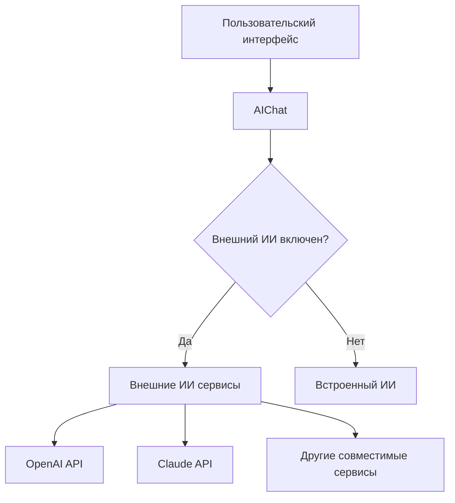

# Роль внешнего ИИ в системе расчета коэффициентов усушки

## 1. Обзор

Внешний ИИ в системе расчета коэффициентов усушки играет вспомогательную роль, предоставляя пользователям расширенные возможности для взаимодействия с системой. Внешний ИИ интегрирован через чат-интерфейс в графических интерфейсах пользователя и используется для помощи в понимании работы системы, подготовке данных и интерпретации результатов.

## 2. Архитектура интеграции

### 2.1 Компоненты интеграции

### 2.2 Класс AIChat

Основной компонент интеграции внешнего ИИ реализован в классе `AIChat`, который находится в модуле `src/core/ai_chat.py`. Этот класс предоставляет следующие функции:

- Обработку запросов пользователей
- Интеграцию с внешними ИИ сервисами через API
- Встроенную реализацию ИИ для базовой функциональности
- Управление историей чата
- Сохранение и загрузку настроек

## 3. Скрытые паттерны и функции системы

### 3.1 Скрытые возможности базы данных

Система содержит скрытые возможности для расширенной аналитики через базу данных:

1. **AIPattern модель** - Хранит паттерны и аномалии, найденные с помощью ИИ
2. **SurplusPattern модель** - Хранит паттерны излишков для различных типов продукции
3. **PatternValidation модель** - Хранит информацию о валидации паттернов
4. **DataLineage модель** - Отслеживает происхождение данных и их трансформации
5. **MLModelRegistry модель** - Регистр моделей машинного обучения с метаданными

Эти модели указывают на скрытую функциональность системы по анализу паттернов и использованию машинного обучения для улучшения точности расчетов.

### 3.2 Адаптивная модель с секретными параметрами

Адаптивная модель (`AdaptiveShrinkageModel`) содержит скрытые параметры адаптации:

1. **Факторы адаптации**:
   - Температура (`temperature`)
   - Влажность (`humidity`)
   - Сезонность (`season`)
   - Тип продукции (`product_type`)

2. **Сезонные коэффициенты**:
   - Зима: 1.15 (повышенная усушка)
   - Весна: 1.05 (средняя усушка)
   - Лето: 1.25 (максимальная усушка)
   - Осень: 1.10 (повышенная усушка)

3. **Типы продукции с коэффициентами**:
   - Свежая рыба: базовые значения
   - Сушеная/вяленая: минимальная усушка (60% от базовой)
   - Слабосоленая: низкая усушка (70% от базовой)
   - Горячее копчение: умеренная усушка (75% от базовой)
   - Холодное копчение: средняя усушка (85% от базовой)
   - Копченая (общая): средняя усушка (80% от базовой)

## 4. Функции внешнего ИИ

### 4.1 Вспомогательные функции

Внешний ИИ в системе выполняет следующие вспомогательные функции:

1. **Объяснение работы системы**
   - Помощь в понимании принципов расчета коэффициентов усушки
   - Объяснение математических моделей, используемых в системе

2. **Работа с данными**
   - Рекомендации по подготовке данных для расчета
   - Объяснение формата Excel файлов
   - Помощь в интерпретации данных инвентаризации

3. **Интерпретация результатов**
   - Объяснение коэффициентов усушки
   - Помощь в понимании метрик точности
   - Рекомендации по улучшению точности расчетов

4. **Решение технических проблем**
   - Помощь при возникновении ошибок
   - Рекомендации по настройке системы
   - Объяснение функций конфигурации

### 4.2 Техническая реализация

Внешний ИИ интегрирован через API совместимый с OpenAI. Поддерживаемые сервисы:

- OpenAI (GPT-3.5, GPT-4)
- Claude (Anthropic)
- Другие совместимые сервисы

Для работы внешнего ИИ требуется:
- Действующий API ключ
- Доступ к интернету
- Настройка в конфигурации системы

## 5. Интеграция с основной системой

### 5.1 В графическом интерфейсе Tkinter

В Tkinter GUI ИИ-чат реализован в отдельной вкладке интерфейса:
- Вкладка "ИИ-чат" содержит историю разговора и поле для ввода вопросов
- Кнопка "Отправить" отправляет вопрос в ИИ и отображает ответ
- Кнопка "Очистить" очищает историю чата
- Кнопка "Настройки ИИ" открывает диалог настроек внешних ИИ сервисов

### 5.2 В графическом интерфейсе Flet

В Flet GUI ИИ-чат реализован в нижней части основного интерфейса:
- Область чата отображает историю разговора
- Поле ввода позволяет задавать вопросы ИИ
- Кнопка отправки сообщения
- Кнопка очистки чата
- Кнопка настроек ИИ в заголовке интерфейса

## 6. Взаимодействие с пользователем

### 6.1 История чата

Система сохраняет историю чата в файле `результаты/ai_chat_history.json`, что позволяет:
- Сохранять контекст разговора
- Повторно использовать полезную информацию
- Анализировать типичные вопросы пользователей

### 6.2 Настройки ИИ

Настройки ИИ сохраняются в файле `результаты/ai_chat_settings.json` и включают:
- Включение/выключение внешнего ИИ
- API ключ для внешнего сервиса
- Выбор модели ИИ
- Базовый URL API

## 7. Преимущества и ограничения

### 7.1 Преимущества

1. **Расширенные возможности помощи пользователям**
   - Более точные и подробные ответы по сравнению с встроенным ИИ
   - Возможность обработки сложных запросов
   - Адаптация к стилю общения пользователя

2. **Гибкость интеграции**
   - Поддержка различных ИИ сервисов
   - Возможность выбора модели
   - Настройка параметров запросов

3. **Сохранение контекста**
   - История чата помогает ИИ лучше понимать запросы пользователя
   - Возможность ссылаться на предыдущие сообщения

### 7.2 Ограничения

1. **Зависимость от интернета**
   - Требуется стабильное подключение к интернету
   - Задержки при обработке запросов

2. **Стоимость использования**
   - Расходы на API вызовы внешних сервисов
   - Необходимость управления лимитами использования

3. **Конфиденциальность данных**
   - Передача данных во внешние сервисы
   - Необходимость доверия к поставщику ИИ

## 8. Скрытые возможности и рекомендации по использованию

### 8.1 Скрытые возможности системы

1. **Аналитика паттернов** - Система собирает и анализирует паттерны поведения пользователей и паттерны данных для улучшения точности расчетов
2. **Адаптивные модели** - Система автоматически адаптирует коэффициенты усушки на основе сезонных факторов, типа продукции и условий хранения
3. **Машинное обучение** - Скрытая функциональность позволяет системе обучаться на основе исторических данных и улучшать точность прогнозов
4. **Отслеживание происхождения данных** - Система отслеживает полный путь данных от источника до результата для обеспечения качества

### 8.2 Рекомендации по использованию

1. **Используйте встроенный ИИ для общих вопросов** - он работает без подключения к интернету
2. **Подключайте внешний ИИ для сложных запросов** - более мощные модели могут дать более точные ответы
3. **Сохраняйте историю чата** - она может быть полезна для обучения системы
4. **Регулярно обновляйте API ключи** - для обеспечения безопасности
5. **Используйте сезонные коэффициенты** - учитывайте сезонность при анализе данных усушки
6. **Анализируйте паттерны** - изучайте отчеты о паттернах для улучшения точности расчетов
7. **Применяйте адаптивные модели** - используйте адаптивные модели для учета внешних факторов