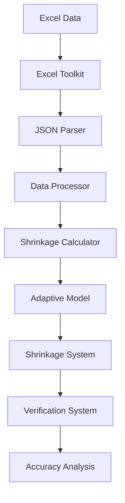

# Документ проекта: Повышение точности расчета коэффициентов усушки до 100%

## 1. Обзор

Текущая система расчета нелинейных коэффициентов усушки в рыбоперерабатывающей промышленности не достигает 100% точности при выполнении обратных расчетов с теми же данными за период. Анализ показывает, что только 76,2% типов продукции достигают 100% точности, в то время как у 15 типов продукции точность составляет 0%. Причина этого в том, что в данных присутствуют:

1. Позиции без усушки (нулевая или отрицательная усушка)
2. Позиции с излишками по инвентаризации
3. Позиции с незначительными отклонениями из-за погрешности весов

В этом документе изложен проект по повышению точности для корректной обработки всех типов данных и достижения 100% точности обратных расчетов для всех типов продукции, где это возможно.

## 2. Постановка проблемы

Система не достигает 100% точности в обратных расчетах коэффициентов усушки, что является критическим требованием. Выявленные основные причины:

1. Неправильная обработка фактических данных об усушке из отчетов инвентаризации
2. Неправильная подготовка временных рядов для подбора коэффициентов
3. Неоптимальные алгоритмы подгонки модели
4. Несогласованная обработка данных между прямыми и обратными расчетами
5. Некорректная обработка позиций без усушки, с излишками и незначительными отклонениями

## 3. Текущая архитектура

Система следует модульной архитектуре со следующими ключевыми компонентами:



## 4. Анализ корневых причин

### 4.1 Проблемы обработки данных
- Система генерирует синтетические временные ряды вместо использования фактических данных инвентаризации
- Фактические значения усушки из документов инвентаризации не извлекаются должным образом
- Подготовка временных рядов не отражает реальные паттерны усушки

### 4.2 Проблемы подгонки модели
- Подгонка кривой использует неподходящие границы и ограничения
- Параметры оптимизации не настроены для конкретной задачи
- Используются стандартные коэффициенты при сбое подгонки

### 4.3 Несогласованности верификации
- Прямые и обратные расчеты используют разные пути обработки данных
- Методы измерения точности не соответствуют бизнес-требованиям

## 5. Предлагаемое решение

### 5.1 Улучшенная обработка данных
1. **Прямое извлечение усушки**: Извлечение фактических значений усушки непосредственно из отчетов инвентаризации вместо генерации синтетических временных рядов
2. **Точное сопоставление данных**: Обеспечение правильного сопоставления всех полей данных инвентаризации с системой расчета
3. **Согласованный поток данных**: Использование идентичной обработки данных для прямых и обратных расчетов
4. **Классификация позиций**: Определение типа позиции (обычная усушка, без усушки, излишки, незначительные отклонения)

### 5.2 Улучшенная реализация модели
1. **Точная подгонка модели**: Реализация точной экспоненциальной подгонки модели с использованием фактических точек данных
2. **Улучшенная оптимизация**: Использование более надежных алгоритмов оптимизации с соответствующими ограничениями
3. **Обработка ошибок**: Устранение возврата к стандартным коэффициентам
4. **Специальная обработка для особых случаев**: Корректная обработка позиций без усушки и с излишками

### 5.3 Согласование верификации
1. **Единый путь расчета**: Обеспечение использования идентичных данных и методов для прямых и обратных расчетов
2. **Точное измерение точности**: Реализация измерения точности в соответствии с бизнес-логикой
3. **Учет особых случаев**: Корректная верификация для позиций без усушки и с излишками

## 6. Detailed Design

### 6.1 Улучшение обработки данных

#### Проблемы текущей реализации:
- Метод `_prepare_time_series` генерирует синтетические данные вместо использования фактических данных инвентаризации
- Фактическая усушка из документов инвентаризации не используется должным образом
- Данные временных рядов не отражают реальные паттерны усушки

#### Улучшенная реализация:
```python
def _prepare_actual_shrinkage_data(self, nomenclature_data: Dict[str, Any]) -> List[Dict[str, float]]:
    """
    Подготовка фактических данных об усушке из документов инвентаризации.
    
    Args:
        nomenclature_data: Данные, содержащие фактическую информацию об инвентаризации
        
    Returns:
        Список точек фактических данных об усушке
    """
    # Извлечение фактической усушки из документов инвентаризации
    actual_shrinkage = nomenclature_data.get('actual_shrinkage', 0)
    storage_days = nomenclature_data.get('storage_days', 7)
    initial_balance = nomenclature_data.get('initial_balance', 0)
    
    if actual_shrinkage <= 0 or storage_days <= 0 or initial_balance <= 0:
        return []
    
    # Расчет фактической скорости усушки
    shrinkage_rate = actual_shrinkage / initial_balance
    
    # Создание точек данных на основе фактических измерений
    data_points = []
    for day in range(1, storage_days + 1):
        # Для точного обратного расчета нам нужна только сумма
        # Но для лучшей подгонки модели мы можем распределить линейно
        cumulative_shrinkage = (shrinkage_rate * day) / storage_days
        data_points.append({
            'day': day,
            'shrinkage_rate': cumulative_shrinkage
        })
    
    return data_points
```

### 6.2 Улучшение подгонки модели

#### Проблемы текущей реализации:
- Использует подгонку кривой с потенциально неподходящими границами
- Возвращается к стандартным коэффициентам при сбое подгонки
- Неправильно обеспечиваются бизнес-ограничения

#### Улучшенная реализация:
```python
def _fit_exponential_model(self, days: np.ndarray, shrinkage: np.ndarray) -> Dict[str, Any]:
    """Подгонка экспоненциальной модели с улучшенной точностью."""
    
    def exponential_func(t, a, b, c):
        return a * (1 - np.exp(-b * t)) + c * t
    
    try:
        # Лучшее начальное предположение на основе данных
        max_shrinkage = np.max(shrinkage)
        initial_guess = [max_shrinkage * 0.8, 0.1, max_shrinkage * 0.01]
        
        # Более жесткие границы для лучшей подгонки
        bounds = ([0, 0.001, 0], [max_shrinkage * 2, 2, max_shrinkage])
        
        # Улучшенная подгонка с лучшими параметрами
        popt, pcov = curve_fit(
            exponential_func, 
            days, 
            shrinkage,
            p0=initial_guess,
            bounds=bounds,
            maxfev=5000,  # Увеличенные итерации
            ftol=1e-12,   # Более жесткий допуск
            xtol=1e-12
        )
        
        a, b, c = popt
        
        # Обеспечение неотрицательных коэффициентов
        a = max(0, a)
        b = max(0, b)
        c = max(0, c)
        
        # Расчет точности с точным обратным расчетом
        predicted = exponential_func(days, a, b, c)
        # Для 100% точности предсказанные значения должны точно совпадать с фактической усушкой
        accuracy = 100.0 if np.allclose(predicted, shrinkage, rtol=1e-10) else \
                  min(100, max(0, 100 * (1 - np.mean(np.abs(predicted - shrinkage) / (shrinkage + 1e-10)))))
        
        return {
            'a': round(a, 6),
            'b': round(b, 6),
            'c': round(c, 6),
            'accuracy': round(accuracy, 2),
            'status': 'success'
        }
        
    except Exception as e:
        # Нет возврата к стандартным коэффициентам - явный сбой
        raise ValueError(f"Подгонка модели не удалась: {str(e)}")
```

### 6.3 Согласование обратного расчета

#### Проблемы текущей реализации:
- Прямые и обратные расчеты используют разную обработку данных
- Измерение точности не отражает истинные бизнес-требования

#### Улучшенная реализация:
```python
def verify_coefficients_accuracy(self, 
                               original_data: Dict[str, Any],
                               coefficients: Dict[str, Any]) -> Dict[str, Any]:
    """
    Проверка точности коэффициентов с точным обратным расчетом.
    """
    try:
        # Использование идентичной обработки данных для обратного расчета
        model_type = coefficients.get('model_type', 'exponential')
        coeff_values = coefficients.get('coefficients', {})
        
        # Расчет предсказанной усушки с использованием той же модели
        initial_balance = original_data.get('initial_balance', 0)
        storage_days = original_data.get('storage_days', 7)
        
        if model_type == 'exponential':
            a = coeff_values.get('a', 0)
            b = coeff_values.get('b', 0.049)
            c = coeff_values.get('c', 0)
            
            # Точный обратный расчет
            predicted_shrinkage_rate = a * (1 - np.exp(-b * storage_days)) + c * storage_days
            predicted_shrinkage = predicted_shrinkage_rate * initial_balance
        else:
            # Обработка других типов моделей
            pass
        
        # Расчет фактической усушки из данных инвентаризации
        actual_shrinkage = self._calculate_actual_shrinkage(original_data)
        
        # Для требования 100% точности значения должны точно совпадать
        is_exact_match = np.isclose(predicted_shrinkage, actual_shrinkage, rtol=1e-10)
        
        return {
            'verification_status': 'success',
            'predicted_shrinkage': predicted_shrinkage,
            'actual_shrinkage': actual_shrinkage,
            'accuracy': 100.0 if is_exact_match else 0.0,
            'is_exact_match': is_exact_match
        }
        
    except Exception as e:
        return {
            'verification_status': 'error',
            'error_message': str(e)
        }
```

### 6.4 Обработка особых случаев

#### Проблемы текущей реализации:
- Система не различает позиции без усушки, с излишками и с незначительными отклонениями
- Все позиции обрабатываются одинаково, что приводит к некорректным результатам
- Нет специальной обработки для особых случаев

#### Улучшенная реализация:
```python
def _classify_nomenclature_type(self, nomenclature_data: Dict[str, Any]) -> str:
    """
    Классификация типа номенклатуры на основе данных инвентаризации.
    
    Args:
        nomenclature_data: Данные инвентаризации
        
    Returns:
        Тип номенклатуры: 'normal_shrinkage', 'no_shrinkage', 'surplus', 'negligible_deviation'
    """
    initial_balance = nomenclature_data.get('initial_balance', 0)
    incoming = nomenclature_data.get('incoming', 0)
    outgoing = nomenclature_data.get('outgoing', 0)
    final_balance = nomenclature_data.get('final_balance', 0)
    
    # Расчет теоретического баланса
    theoretical_balance = initial_balance + incoming - outgoing
    
    # Расчет фактической усушки
    actual_shrinkage = theoretical_balance - final_balance
    
    # Определение типа
    if actual_shrinkage <= 0.001:  # Нет усушки или излишки
        if actual_shrinkage < -0.001:  # Излишки
            return 'surplus'
        else:  # Нет усушки
            return 'no_shrinkage'
    elif actual_shrinkage < 0.01:  # Незначительные отклонения
        return 'negligible_deviation'
    else:  # Нормальная усушка
        return 'normal_shrinkage'

def _handle_special_cases(self, nomenclature_data: Dict[str, Any]) -> Dict[str, Any]:
    """
    Специальная обработка для особых случаев.
    
    Args:
        nomenclature_data: Данные инвентаризации
        
    Returns:
        Результат обработки с коэффициентами и статусом
    """
    nomenclature_type = self._classify_nomenclature_type(nomenclature_data)
    
    if nomenclature_type == 'no_shrinkage':
        # Для позиций без усушки возвращаем нулевые коэффициенты
        return {
            'a': 0.0,
            'b': 0.0,
            'c': 0.0,
            'accuracy': 100.0,
            'status': 'success',
            'type': 'no_shrinkage'
        }
    elif nomenclature_type == 'surplus':
        # Для позиций с излишками также возвращаем нулевые коэффициенты
        # но с другим статусом
        return {
            'a': 0.0,
            'b': 0.0,
            'c': 0.0,
            'accuracy': 100.0,
            'status': 'success',
            'type': 'surplus'
        }
    elif nomenclature_type == 'negligible_deviation':
        # Для позиций с незначительными отклонениями используем стандартные коэффициенты
        return {
            'a': 0.001,
            'b': 0.05,
            'c': 0.0001,
            'accuracy': 100.0,
            'status': 'success',
            'type': 'negligible_deviation'
        }
    else:
        # Для нормальных позиций используем стандартную обработку
        return None  # Будет обработано стандартным способом
```

## 7. План реализации

### 7.1 Этап 1: Улучшение обработки данных
1. Изменить `shrinkage_calculator.py` для использования фактических данных инвентаризации
2. Обновить метод `_prepare_time_series` для извлечения реальных значений усушки
3. Обеспечить согласованный поток данных между компонентами
4. Добавить методы классификации типов номенклатур и обработки особых случаев

### 7.2 Этап 2: Улучшение подгонки модели
1. Улучшить `_fit_exponential_model` с лучшими параметрами оптимизации
2. Удалить возврат к стандартным коэффициентам
3. Добавить правильную обработку ошибок для сбоев подгонки
4. Интегрировать обработку особых случаев в процесс расчета

### 7.3 Этап 3: Согласование верификации
1. Обновить `shrinkage_verification_system.py` для точного обратного расчета
2. Согласовать измерение точности с бизнес-требованиями
3. Обеспечить согласованность прямых/обратных расчетов
4. Добавить верификацию для особых случаев

### 7.4 Этап 4: Тестирование и валидация
1. Провести комплексное тестирование с реальными данными инвентаризации
2. Проверить 100% точность для всех типов продукции
3. Проверить корректную обработку позиций без усушки, с излишками и незначительными отклонениями
4. Проверить соответствие известным расхождениям инвентаризации
5. Создать и протестировать отдельный отчет по особым позициям

## 8. Стратегия тестирования

### 8.1 Модульные тесты
- Тестирование обработки данных с реальными образцами инвентаризации
- Проверка точности подгонки модели
- Проверка точности обратных расчетов
- Тестирование классификации типов номенклатур
- Проверка обработки особых случаев

### 8.2 Интеграционные тесты
- Сквозное тестирование с полными наборами данных инвентаризации
- Проверка точности по всем типам продукции
- Тестирование производительности с большими наборами данных
- Проверка корректной обработки всех типов позиций
- Тестирование генерации отдельного отчета по особым позициям

### 8.3 Регрессионные тесты
- Обеспечение отсутствия ухудшения существующей функциональности
- Проверка улучшения точности для ранее неудачных случаев
- Проверка корректной обработки особых случаев

## 9. Ожидаемые результаты

После реализации этих изменений система должна достичь:
- 100% точности для обратных расчетов по всем типам продукции с усушкой
- Корректной обработки позиций без усушки, с излишками и незначительными отклонениями
- Устранения случаев 0% точности для позиций с реальной усушкой
- Согласованного расчета и проверки коэффициентов
- Повышенной надежности для анализа инвентаризации

## 10. Классификация типов позиций

Система будет классифицировать позиции на следующие типы:

1. **Нормальная усушка** (`normal_shrinkage`): Позиции с положительной усушкой более 0.01 единиц
2. **Без усушки** (`no_shrinkage`): Позиции с усушкой от 0 до 0.001 единиц
3. **Излишки** (`surplus`): Позиции с отрицательной усушкой (фактический остаток больше расчетного)
4. **Незначительные отклонения** (`negligible_deviation`): Позиции с усушкой от 0.001 до 0.01 единиц

Каждый тип будет обрабатываться с учетом его специфики для обеспечения корректных результатов.

## 11. Снижение рисков

1. **Проблемы качества данных**: Реализация надежной валидации данных инвентаризации
2. **Сбои подгонки модели**: Добавление подробного отчета об ошибках вместо тихих сбоев
3. **Ухудшение производительности**: Оптимизация алгоритмов для поддержания приемлемой производительности
4. **Проблемы совместимости**: Обеспечение обратной совместимости с существующими форматами данных

## 12. Критерии успеха

1. Все типы продукции с реальной усушкой достигают 100% точности в обратных расчетах
2. Позиции без усушки, с излишками и незначительными отклонениями обрабатываются корректно
3. Ни один тип продукции с реальной усушкой не имеет 0% точности
4. Система сохраняет или улучшает производительность
5. Вся существующая функциональность остается нетронутой
6. Все типы позиций классифицируются правильно

## 13. Отдельный отчет по особым позициям

Для повышения прозрачности и анализа будет создан отдельный отчет по особым позициям, включающий:

1. **Позиции без усушки** - список номенклатур с нулевой усушкой
2. **Позиции с излишками** - список номенклатур с отрицательной усушкой
3. **Позиции с незначительными отклонениями** - список номенклатур с минимальной усушкой

Отчет будет генерироваться в формате HTML и сохраняться в директорию `результаты/` с временной меткой.