# Полная функциональность всех интерфейсов системы

## Общая архитектура

Система предоставляет три различных интерфейса для работы с расчетом коэффициентов нелинейной усушки:

1. **Flet GUI** - Современный графический интерфейс
2. **Tkinter GUI** - Классический десктопный интерфейс
3. **Streamlit Dashboard** - Веб-дашборд для анализа результатов

Все интерфейсы взаимодействуют с общим ядром системы, обеспечивая согласованность функциональности.

## 1. Flet GUI (src/gui.py)

### Основные функции:
- Выбор Excel файла через диалоговое окно
- Конвертация Excel в JSON с сохранением иерархии
- Парсинг JSON данных в DataFrame
- Расчет коэффициентов усушки
- Генерация HTML отчетов
- Открытие отчетов в браузере
- Открытие папки с результатами

### Параметры расчета:
- Использование адаптивной модели расчета
- Учет процента излишка при поступлении (с настройкой процента)

### Особенности интерфейса:
- Современный дизайн с использованием Flet
- Индикатор прогресса выполнения операций
- Всплывающие уведомления о статусе операций
- Автоматическое обновление статуса выполнения

## 2. Tkinter GUI (src/tkinter_gui.py)

### Основные функции:
- Выбор Excel файла через диалоговое окно
- Два режима обработки:
  - Стандартная обработка (общий формат Excel)
  - Специализированная обработка партий рыбы
- Конвертация Excel в JSON с сохранением иерархии
- Парсинг JSON данных в DataFrame
- Расчет коэффициентов усушки
- Генерация HTML отчетов
- Открытие отчетов в браузере
- Открытие отчетов об ошибках
- Открытие папки с результатами

### Параметры расчета:
- Использование адаптивной модели расчета
- Учет процента излишка при поступлении (с настройкой процента)

### Утилиты:
- Организация тестовых данных
- Открытие папки с результатами

### Особенности интерфейса:
- Многостраничный интерфейс с вкладками:
  - Основное (расчет)
  - Утилиты (управление данными)
  - Помощь (руководство пользователя)
- Современный дизайн с использованием ttk стилей
- Прогресс-бар выполнения операций
- Журнал выполнения операций с прокруткой
- Многопоточное выполнение расчетов (не блокирует UI)
- Поддержка горячих клавиш и стандартных элементов управления

## 3. Streamlit Dashboard (src/dashboard.py)

### Основные функции:
- Выбор отчета для анализа из доступных HTML отчетов
- Открытие отчетов в браузере
- Открытие папки с отчетами

### Фильтрация данных:
- По точности расчетов (слайдер)
- По названию номенклатуры (текстовый поиск)
- По диапазону коэффициентов A и B (слайдеры)

### Аналитические возможности:
- Сводная статистика:
  - Всего позиций
  - Средний коэффициент A
  - Средний коэффициент B
  - Средняя точность
- Таблица результатов с возможностью сортировки
- Визуализация:
  - Распределение точности (гистограмма)
  - Распределение по категориям точности (круговая диаграмма)
  - Корреляция между коэффициентами A и B (диаграмма рассеяния)
  - Распределение коэффициентов A и B (гистограммы)
- Анализ топ-позиций:
  - Топ-10 по точности
  - Топ-10 по коэффициенту A

### Особенности интерфейса:
- Современный дизайн с кастомными CSS стилями
- Адаптивная верстка для разных устройств
- Интерактивные графики с помощью Plotly
- Анимации и визуальные эффекты
- Информационные панели и подсказки
- Расширенные фильтры в боковой панели

## Общая функциональность ядра системы

### Математическая модель:
- Используется формула нелинейной усушки: S(t) = a*(1 - exp(-b*t)) + c*t
- Анализ недостач из данных инвентаризации
- Учет процента излишка при поступлении

### Основные компоненты:
- `ShrinkageSystem` - Оркестратор системы
- `ExcelHierarchyPreserver` - Сохранение иерархии Excel
- `ImprovedJsonParser` - Парсер JSON данных
- `DataProcessor` - Процессор данных
- `ShrinkageCalculator` - Базовый калькулятор усушки
- `AdaptiveShrinkageModel` - Адаптивная модель расчета
- `ReportGenerator` - Генератор отчетов

## Диаграмма функциональности

```mermaid
graph TD
    A[Пользователь] --> B{Выбор интерфейса}
    B --> C[Flet GUI]
    B --> D[Tkinter GUI]
    B --> E[Streamlit Dashboard]
    
    C --> F[Выбор Excel файла]
    C --> G[Конвертация в JSON]
    C --> H[Парсинг данных]
    C --> I[Расчет коэффициентов]
    C --> J[Генерация отчетов]
    C --> K[Открытие отчетов]
    C --> L[Открытие папки результатов]
    
    D --> M[Выбор Excel файла]
    D --> N[Режим обработки]
    D --> O[Конвертация в JSON]
    D --> P[Парсинг данных]
    D --> Q[Расчет коэффициентов]
    D --> R[Генерация отчетов]
    D --> S[Открытие отчетов]
    D --> T[Журнал операций]
    D --> U[Утилиты]
    
    E --> V[Выбор отчета]
    E --> W[Фильтрация данных]
    E --> X[Сводная статистика]
    E --> Y[Таблица результатов]
    E --> Z[Визуализация]
    E --> AA[Анализ топ-позиций]
    
    I --> AB[Ядро системы]
    Q --> AB
    W --> AC[Обработанные данные]
    AB --> AC
    
    AB --> AD[ShrinkageSystem]
    AD --> AE[ExcelHierarchyPreserver]
    AD --> AF[ImprovedJsonParser]
    AD --> AG[DataProcessor]
    AD --> AH[ShrinkageCalculator]
    AD --> AI[AdaptiveShrinkageModel]
    AD --> AJ[ReportGenerator]
    
    U --> AK[Организация тестовых данных]
    U --> AL[Открытие папки результатов]
    
    W --> AM[Точность расчетов]
    W --> AN[Название номенклатуры]
    W --> AO[Диапазон коэффициентов]
    
    X --> AP[Всего позиций]
    X --> AQ[Средний коэффициент A]
    X --> AR[Средний коэффициент B]
    X --> AS[Средняя точность]
    
    Y --> AT[Сортировка данных]
    Y --> AU[Фильтрация]
    
    Z --> AV[Распределение точности]
    Z --> AW[Категории точности]
    Z --> AX[Корреляция коэффициентов]
    Z --> AY[Распределение коэффициентов]
    
    AA --> AZ[Топ-10 по точности]
    AA --> BA[Топ-10 по коэффициенту A]
    
    style A fill:#4a6fa5,stroke:#333,stroke-width:2px,color:#fff
    style B fill:#6b5b95,stroke:#333,stroke-width:2px,color:#fff
    style C fill:#8fbc8f,stroke:#333,stroke-width:2px,color:#000
    style D fill:#cd853f,stroke:#333,stroke-width:2px,color:#000
    style E fill:#9370db,stroke:#333,stroke-width:2px,color:#fff
    style AB fill:#ff7f7f,stroke:#333,stroke-width:2px,color:#000
    style AD fill:#ffa07a,stroke:#333,stroke-width:2px,color:#000
    
    classDef user fill:#4a6fa5,stroke:#333,stroke-width:2px,color:#fff;
    classDef interface fill:#6b5b95,stroke:#333,stroke-width:2px,color:#fff;
    classDef guiFunction fill:#8fbc8f,stroke:#333,stroke-width:2px,color:#000;
    classDef dashboardFunction fill:#9370db,stroke:#333,stroke-width:2px,color:#fff;
    classDef core fill:#ff7f7f,stroke:#333,stroke-width:2px,color:#000;
    classDef component fill:#ffa07a,stroke:#333,stroke-width:2px,color:#000;
```

