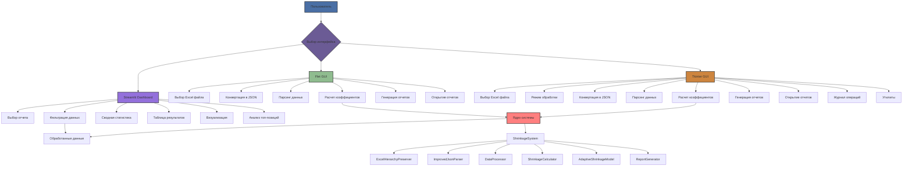

# Диаграмма функциональности всех интерфейсов

```mermaid
graph TB
    A[Пользователь] --> B{Выбор интерфейса}
    B --> C[Flet GUI]
    B --> D[Tkinter GUI]
    B --> E[Streamlit Dashboard]
    
    C --> F[Выбор Excel файла]
    C --> G[Конвертация в JSON]
    C --> H[Парсинг данных]
    C --> I[Расчет коэффициентов]
    C --> J[Генерация отчетов]
    C --> K[Открытие отчетов]
    
    D --> L[Выбор Excel файла]
    D --> M[Режим обработки]
    D --> N[Конвертация в JSON]
    D --> O[Парсинг данных]
    D --> P[Расчет коэффициентов]
    D --> Q[Генерация отчетов]
    D --> R[Открытие отчетов]
    D --> S[Журнал операций]
    D --> T[Утилиты]
    
    E --> U[Выбор отчета]
    E --> V[Фильтрация данных]
    E --> W[Сводная статистика]
    E --> X[Таблица результатов]
    E --> Y[Визуализация]
    E --> Z[Анализ топ-позиций]
    
    I --> AA[Ядро системы]
    P --> AA
    V --> AB[Обработанные данные]
    AA --> AB
    
    AA --> AC[ShrinkageSystem]
    AC --> AD[ExcelHierarchyPreserver]
    AC --> AE[ImprovedJsonParser]
    AC --> AF[DataProcessor]
    AC --> AG[ShrinkageCalculator]
    AC --> AH[AdaptiveShrinkageModel]
    AC --> AI[ReportGenerator]
    
    style A fill:#4a6fa5,stroke:#333,stroke-width:2px
    style B fill:#6b5b95,stroke:#333,stroke-width:2px
    style C fill:#8fbc8f,stroke:#333,stroke-width:2px
    style D fill:#cd853f,stroke:#333,stroke-width:2px
    style E fill:#9370db,stroke:#333,stroke-width:2px
    style AA fill:#ff7f7f,stroke:#333,stroke-width:2px
    
    classDef user fill:#4a6fa5,stroke:#333,stroke-width:2px;
    classDef interface fill:#6b5b95,stroke:#333,stroke-width:2px;
    classDef guiFunction fill:#8fbc8f,stroke:#333,stroke-width:2px;
    classDef dashboardFunction fill:#9370db,stroke:#333,stroke-width:2px;
    classDef core fill:#ff7f7f,stroke:#333,stroke-width:2px;
    classDef component fill:#ffa07a,stroke:#333,stroke-width:2px;
```