# Обзор функциональности всех интерфейсов системы расчета коэффициентов усушки

## 1. Общая архитектура

Система предоставляет три интерфейса для взаимодействия с пользователем:

1. **Flet GUI** - Современный графический интерфейс
2. **Tkinter GUI** - Классический десктопный интерфейс
3. **Streamlit Dashboard** - Веб-дашборд для анализа результатов

Все интерфейсы используют общее ядро системы для обработки данных.

## 2. Функциональность Flet GUI

### Основные возможности:
- Выбор Excel файла через диалог
- Конвертация Excel в JSON с сохранением иерархии
- Парсинг JSON данных
- Расчет коэффициентов усушки
- Генерация HTML отчетов
- Открытие отчетов в браузере
- Открытие папки с результатами
- Автоматическая проверка наличия инвентаризаций (начальный остаток автоматически устанавливается равным 0.0 при отсутствии)
- Помощь и руководство пользователя
- **ИИ-чат для помощи в работе с системой**

### Параметры расчета:
- Использование адаптивной модели
- Учет процента излишка при поступлении

## 3. Функциональность Tkinter GUI

### Основные возможности:
- Выбор Excel файла через диалог
- Два режима обработки:
  - Стандартная обработка (общий формат Excel)
  - Специализированная обработка партий рыбы
- Конвертация Excel в JSON с сохранением иерархии
- Парсинг JSON данных
- Расчет коэффициентов усушки
- Генерация HTML отчетов
- Открытие отчетов в браузере
- Открытие отчетов об ошибках
- Открытие папки с результатами
- Прогресс-бар выполнения
- Журнал выполнения операций
- Автоматическая проверка наличия инвентаризаций (начальный остаток автоматически устанавливается равным 0.0 при отсутствии)
- **ИИ-чат для помощи в работе с системой**

### Параметры расчета:
- Использование адаптивной модели
- Учет процента излишка при поступлении

### Утилиты:
- Организация тестовых данных
- Открытие папки с результатами

### Вкладки:
- Основное (расчет)
- Утилиты (управление данными)
- **ИИ-чат (взаимодействие с ИИ-ассистентом)**
- Помощь (руководство пользователя)

## 4. Функциональность Streamlit Dashboard

### Основные возможности:
- Выбор отчета для анализа из доступных
- Открытие отчетов в браузере
- Открытие папки с отчетами
- Фильтрация данных:
  - По точности расчетов
  - По названию номенклатуры
  - По диапазону коэффициентов A и B
- Сводная статистика:
  - Всего позиций
  - Средний коэффициент A
  - Средний коэффициент B
  - Средняя точность
- Таблица результатов с возможностью сортировки
- Визуализация:
  - Распределение точности (гистограмма)
  - Распределение по категориям точности (круговая диаграмма)
  - Корреляция между коэффициентами A и B (диаграмма рассеяния)
  - Распределение коэффициентов A и B (гистограммы)
  - Топ-10 по точности
  - Топ-10 по коэффициенту A

## 5. Общая функциональность ядра системы

### Основные компоненты:
- `ShrinkageSystem` - Оркестратор системы
- `ExcelHierarchyPreserver` - Сохранение иерархии Excel
- `ImprovedJsonParser` - Парсер JSON данных
- `ShrinkageCalculator` - Базовый калькулятор усушки
- `AdaptiveShrinkageModel` - Адаптивная модель расчета
- `DataProcessor` - Процессор данных
- `ReportGenerator` - Генератор отчетов
- `AIChat` - ИИ-чат для помощи пользователям

### Математическая модель:
- Используется формула нелинейной усушки: S(t) = a*(1 - exp(-b*t)) + c*t
- Анализ недостач из данных инвентаризации
- Учет процента излишка при поступлении
- Автоматическая проверка наличия начальной и конечной инвентаризаций

## 6. Диаграмма функциональности

```mermaid
graph TB
    A[Пользователь] --> B{Выбор интерфейса}
    B --> C[Flet GUI]
    B --> D[Tkinter GUI]
    B --> E[Streamlit Dashboard]
    
    C --> F[Выбор Excel файла]
    C --> G[Конвертация в JSON]
    C --> H[Парсинг данных]
    C --> I[Расчет коэффициентов]
    C --> J[Генерация отчетов]
    C --> K[Открытие отчетов]
    C --> CA[Проверка инвентаризаций]
    C --> CB[Помощь и руководство]
    C --> CC[ИИ-чат]
    
    D --> L[Выбор Excel файла]
    D --> M[Режим обработки]
    D --> N[Конвертация в JSON]
    D --> O[Парсинг данных]
    D --> P[Расчет коэффициентов]
    D --> Q[Генерация отчетов]
    D --> R[Открытие отчетов]
    D --> S[Журнал операций]
    D --> T[Утилиты]
    D --> DA[Проверка инвентаризаций]
    D --> DB[ИИ-чат]
    
    E --> U[Выбор отчета]
    E --> V[Фильтрация данных]
    E --> W[Сводная статистика]
    E --> X[Таблица результатов]
    E --> Y[Визуализация]
    E --> Z[Анализ топ-позиций]
    
    I --> AA[Ядро системы]
    P --> AA
    V --> AB[Обработанные данные]
    AA --> AB
    
    AA --> AC[ShrinkageSystem]
    AC --> AD[ExcelHierarchyPreserver]
    AC --> AE[ImprovedJsonParser]
    AC --> AF[DataProcessor]
    AC --> AG[ShrinkageCalculator]
    AC --> AH[AdaptiveShrinkageModel]
    AC --> AI[ReportGenerator]
    AC --> AJ[AIChat]
    
    style A fill:#4a6fa5,stroke:#333,stroke-width:2px
    style B fill:#6b5b95,stroke:#333,stroke-width:2px
    style C fill:#8fbc8f,stroke:#333,stroke-width:2px
    style D fill:#cd853f,stroke:#333,stroke-width:2px
    style E fill:#9370db,stroke:#333,stroke-width:2px
    style AA fill:#ff7f7f,stroke:#333,stroke-width:2px
    
    classDef user fill:#4a6fa5,stroke:#333,stroke-width:2px;
    classDef interface fill:#6b5b95,stroke:#333,stroke-width:2px;
    classDef guiFunction fill:#8fbc8f,stroke:#333,stroke-width:2px;
    classDef dashboardFunction fill:#9370db,stroke:#333,stroke-width:2px;
    classDef core fill:#ff7f7f,stroke:#333,stroke-width:2px;
    classDef component fill:#ffa07a,stroke:#333,stroke-width:2px;
```

