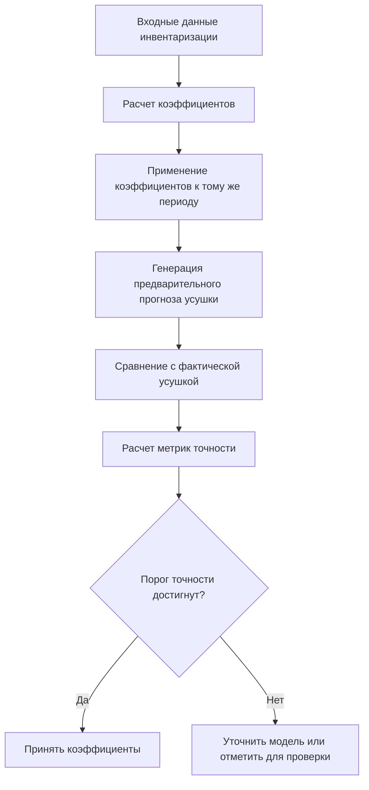

# Система верификации точности коэффициентов усушки

## Обзор

Система верификации точности коэффициентов усушки обеспечивает надежность рассчитанных коэффициентов путем выполнения обратных расчетов с использованием полученных коэффициентов для проверки того, что они дают результаты, согласующиеся с исходными данными. Этот подход проверяет, что математические модели точно представляют фактические закономерности усушки, наблюдаемые в данных инвентаризации.

Система работает по принципу, что если коэффициенты рассчитаны правильно, то их применение к тому же периоду должно воспроизвести исходные результаты усушки в пределах допустимой погрешности.

## Архитектура системы

### Основные компоненты

```mermaid
graph TD
    A[Данные инвентаризации] --> B[Калькулятор усушки]
    B --> C[Расчет коэффициентов]
    C --> D[Подгонка модели]
    D --> E[Коэффициенты]
    E --> F[Проверка точности]
    F --> G[Отчет о валидации]
    
    subgraph "Процесс проверки точности"
        E --> H[Движок обратных расчетов]
        H --> I[Предварительный расчет усушки]
        I --> J[Логика сравнения]
        A --> J
        J --> K[Метрики точности]
        K --> G
    endgraph
```

### Описание компонентов

| Компонент | Ответственность |
|-----------|----------------|
| Калькулятор усушки | Рассчитывает коэффициенты усушки с использованием различных математических моделей |
| Подгонка модели | Подгоняет математические модели к данным инвентаризации для получения коэффициентов |
| Движок обратных расчетов | Использует рассчитанные коэффициенты для прогнозирования усушки за тот же период |
| Логика сравнения | Сравнивает прогнозируемую усушку с фактической усушкой из данных инвентаризации |
| Метрики точности | Рассчитывает метрики точности, такие как R², RMSE и MAE |

## Процесс проверки точности

### Схема процесса



### Детальные шаги

1. **Расчет коэффициентов**: Система анализирует данные инвентаризации для расчета коэффициентов усушки с использованием математических моделей (экспоненциальная, линейная, полиномиальная).

2. **Применение модели**: Рассчитанные коэффициенты затем применяются к тому же временному периоду для прогнозирования того, какой должна была быть усушка.

3. **Генерация прогноза**: Используя метод `calculate_preliminary_shrinkage`, система генерирует прогнозируемое значение усушки на основе рассчитанных коэффициентов.

4. **Сравнение**: Прогнозируемая усушка сравнивается с фактической усушкой, наблюдаемой в данных инвентаризации.

5. **Расчет метрик точности**: Система рассчитывает различные метрики точности:
   - R² (Коэффициент детерминации)
   - RMSE (Среднеквадратическая ошибка)
   - MAE (Средняя абсолютная ошибка)

6. **Решение о валидации**: На основе метрик точности система определяет, приемлемы ли коэффициенты или нуждаются в уточнении.

## Математические модели

### Экспоненциальная модель
```
S(t) = a * (1 - exp(-b*t)) + c*t
```
Где:
- S(t) - усушка в долях от начального остатка в момент времени t
- a, b, c - коэффициенты, которые необходимо определить
- t - время хранения в днях

### Линейная модель
```
S(t) = a*t + b
```

### Полиномиальная модель
```
S(t) = a*t² + b*t + c
```

## Метрики точности

### R² (Коэффициент детерминации)
Измеряет, насколько хорошо модель объясняет дисперсию данных:
```
R² = 1 - (SS_res / SS_tot)
```
Где:
- SS_res - сумма квадратов остатков
- SS_tot - общая сумма квадратов

### RMSE (Среднеквадратическая ошибка)
Измеряет среднюю величину ошибки:
```
RMSE = √(Σ(прогноз - фактическое)² / n)
```

### MAE (Средняя абсолютная ошибка)
Измеряет среднюю абсолютную разницу между прогнозируемыми и фактическими значениями:
```
MAE = Σ|прогноз - фактическое| / n
```

## Критерии валидации

Система использует следующие критерии для проверки точности коэффициентов:

| Метрика | Приемлемый диапазон | Предупреждающий диапазон | Критический диапазон |
|--------|------------------|---------------|----------------|
| R² | > 0.85 | 0.7 - 0.85 | < 0.7 |
| RMSE | < 0.05 | 0.05 - 0.1 | > 0.1 |
| MAE | < 0.03 | 0.03 - 0.07 | > 0.07 |

## Интеграция с основной системой

Система верификации интегрирована с основной системой расчета усушки и может быть включена через конфигурационный параметр `enable_verification`. При включении система автоматически выполняет верификацию для всех рассчитанных коэффициентов и добавляет результаты в отчеты.

## Использование

### Включение верификации

Для включения верификации добавьте в конфигурацию:
```python
config = {
    'enable_verification': True
}
```

### Ручная верификация

Для ручной верификации коэффициентов используйте:
```python
from core.shrinkage_verification_system import ShrinkageVerificationSystem

# Создание системы верификации
verification_system = ShrinkageVerificationSystem()

# Подготовка данных
original_data = {
    'name': 'Рыба свежая',
    'initial_balance': 100.0,
    'incoming': 50.0,
    'outgoing': 20.0,
    'final_balance': 128.0,
    'storage_days': 7
}

coefficients = {
    'model_type': 'exponential',
    'coefficients': {'a': 0.015, 'b': 0.049, 'c': 0.001},
    'r_squared': 0.95
}

# Выполнение верификации
results = verification_system.verify_coefficients_accuracy(original_data, coefficients)

# Генерация отчета
report = verification_system.generate_verification_report(results)
print(report)
```

## Примеры использования

См. примеры в папке `examples`:
- [пример_верификации_коэффициентов.py](../examples/пример_верификации_коэффициентов.py) - Демонстрация использования системы верификации

## Тестирование

См. тесты в папке `tests`:
- [test_shrinkage_verification.py](../tests/test_shrinkage_verification.py) - Основные тесты системы верификации
- [test_shrinkage_system_integration.py](../tests/test_shrinkage_system_integration.py) - Тесты интеграции с основной системой